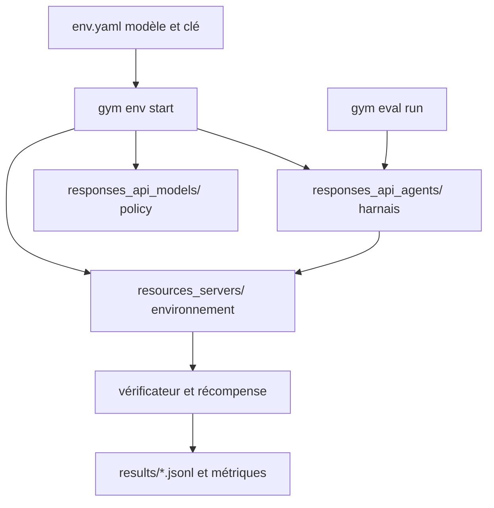

# NVIDIA-NeMo/Gym

> Bibliothèque d'environnements pour évaluer et entraîner des agents à grande échelle.

## Le problème
Évaluer un agent dans un environnement à état — exécution de code, appels d'outils, bac à sable — se termine en scripts jetables non reproductibles.
Passer de l'évaluation à l'entraînement par renforcement impose de tout réécrire.

## Ce que ça fait vraiment
Un environnement y réunit quatre choses : un jeu de tâches, un harnais d'agent, un vérificateur de réussite et un état d'exécution par tâche.
Trois serveurs locaux coordonnent modèle, agent et vérification ; `gym eval run` collecte les déroulés et agrège les métriques (`pass@1/accuracy`, récompense moyenne).
Fournit un catalogue d'environnements avec données d'exemple, configuration et tests — SWE-bench et Terminal Bench pilotés par différents harnais, ARC-AGI, suivi d'instructions, abstention.
Se combine avec d'autres bibliothèques d'environnements (Aviary, OpenEnv, Verifiers) et de frameworks d'entraînement (NeMo RL, Unsloth, VeRL).

## Comment c'est branché


## Essayer
```bash
git clone https://github.com/NVIDIA-NeMo/Gym.git
cd Gym
uv venv --python 3.13.14 && source .venv/bin/activate
uv sync
gym env start --resources-server mcqa --model-type openai_model
gym eval run --no-serve --agent mcqa_simple_agent \
    --input resources_servers/mcqa/data/example.jsonl \
    --output results/mcqa_rollouts.jsonl --limit 5 --num-repeats 1
```

## Coût et pièges
Le démarrage rapide exige une clé OpenAI créditée ; d'autres fournisseurs sont possibles (Azure, vLLM auto-hébergé).
Python 3.13.14+ et `uv` obligatoires, 8 Go de RAM minimum, aucun GPU requis pour la bibliothèque elle-même.
Le conteneur officiel omet `opencv-python-headless`, `torchvision` et `torchaudio` : les réinstaller par `bash docker/install_codec_deps.sh` avant tout banc VLM ou audio/vidéo.

## Ce que ce n'est pas
Pas stable : le README annonce des API mouvantes, une documentation incomplète et des bugs, et demande d'ouvrir une issue avant toute contribution.
Pas utile pour une vérification sans état : le README dit lui-même qu'un simple script suffit alors.
Pas une collection de jeux de données prêts : beaucoup d'environnements n'ont pas de données publiées, seulement cinq tâches d'exemple.

## Alternatives
- Aviary, OpenEnv, Reasoning Gym, Verifiers : autres bibliothèques d'environnements, combinables plutôt que concurrentes.
- NeMo RL, Unsloth, VeRL : côté entraînement, si le besoin est le RL et non l'environnement.

## Pour toi
Le bon cadre si tu dois mesurer un agent de façon reproductible ; à tenir à distance de la production tant que les API bougent.
