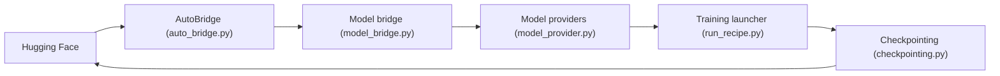

# NVIDIA-NeMo/Megatron-Bridge

> Bibliothèque NVIDIA qui convertit des modèles Hugging Face vers Megatron Core, pour les entraîner ou les affiner.

## Le problème
Les modèles Hugging Face ne profitent pas directement des parallélismes de Megatron Core, et les checkpoints des deux mondes ne sont pas interchangeables.

## Ce que ça fait vraiment
Convertit dans les deux sens (HF ↔ Megatron) via `AutoBridge`, en tenant compte du parallélisme et en streamant paramètre par paramètre. Fournit aussi une boucle d'entraînement PyTorch avec recettes de pré-entraînement, SFT et LoRA/DoRA (FP8, BF16, FP4). Le graphe ajoute inférence, diffusion (FLUX, WAN) et conversion PEFT.

## Comment c'est branché


## Essayer
```bash
docker run --rm -it -w /workdir -v $(pwd):/workdir \
  --entrypoint bash \
  --gpus all \
  nvcr.io/nvidia/nemo:${TAG}
huggingface-cli login --token <your token>
uv run python -m torch.distributed.run --nproc-per-node=<num devices> /path/to/script.py
```

## Coût et pièges
GPU requis, conteneur NeMo recommandé pour la fonctionnalité complète ; Megatron-Core est un sous-module épinglé (`switch_mcore.sh` main/dev, `uv sync` à relancer). Compte Hugging Face pour les modèles à accès restreint.

## Ce que ce n'est pas
Pas un outil léger pour un poste sans GPU. La branche dev de Megatron-Core est expérimentale. 472 issues ouvertes : le projet bouge vite.

## Alternatives
Aucune alternative nommée dans le README.

## Pour toi
À surveiller : utile si tu entraînes ou affines à grande échelle sur GPU NVIDIA avec Megatron, inutile pour de l'inférence ou un fine-tuning modeste.

