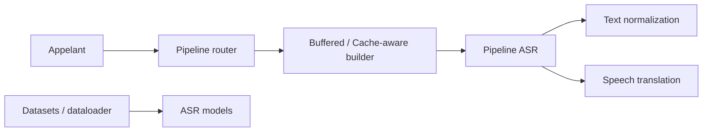

# NVIDIA-NeMo/NeMo

> Boîte à outils PyTorch pour créer, adapter et déployer des modèles de parole (ASR, TTS, Speech LLM).

## Le problème
Entraîner ou adapter un modèle de reconnaissance ou de synthèse vocale demande de recoller données, architectures et déploiement.

## Ce que ça fait vraiment
Bibliothèque pour chercheurs et développeurs PyTorch : reconnaissance vocale (dont un pipeline en flux, tamponné ou à cache), synthèse (Magpie TTS), transformation audio, agent vocal temps réel par WebSocket, chargement de données et objectifs d'entraînement. Elle propose des checkpoints pré-entraînés sur Hugging Face. Le dépôt est présenté sous le nom NeMo Speech.

## Comment c'est branché


## Essayer
```bash
git clone https://github.com/NVIDIA-NeMo/Speech.git
cd Speech
uv sync --extra all --extra cu13
```
```bash
uv pip install 'nemo-toolkit[asr,tts]'
```

## Coût et pièges
GPU NVIDIA + CUDA requis pour l'entraînement, recommandés pour l'inférence. Python 3.12+, PyTorch 2.7+. Ne pas utiliser `uv sync --locked` sur un environnement existant : il remplace ta pile. `TORCH_FORCE_NO_WEIGHTS_ONLY_LOAD=1` seulement pour des fichiers de confiance.

## Ce que ce n'est pas
Pas un service clé en main. Le diagramme n'échantillonne surtout que l'ASR en flux ; le câblage des autres sous-systèmes n'est pas établi.

## Alternatives
Aucune alternative nommée dans le README.

## Pour toi
À adopter si tu fais de la parole sur GPU NVIDIA : éditeur constant, checkpoints ouverts et stack reproductible via `uv.lock`.
