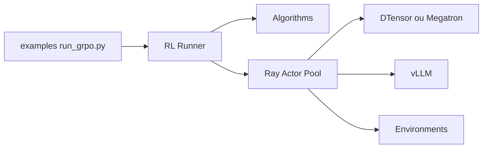

# NVIDIA-NeMo/RL

> Bibliothèque de post-entraînement par apprentissage par renforcement pour LLM et VLM, du prototype au multi-nœuds.

## Le problème
Aligner et affiner des modèles (GRPO, DPO, distillation) à grande échelle demande d'orchestrer entraînement, génération et environnements de récompense.

## Ce que ça fait vraiment
Sur Ray, l'orchestrateur relie algorithmes (GRPO/GSPO/DAPO, SFT avec LoRA, DPO, modèle de récompense, distillation on-policy et cross-tokenizer), données, environnements (maths, jeux, VLM) et backends d'entraînement (DTensor ou Megatron Core) ainsi que de génération (vLLM, Megatron, SGLang). Rollouts multi-tours et RL asynchrone. Lancement en local, Slurm ou Kubernetes.

## Comment c'est branché


## Essayer
```bash
git clone git@github.com:NVIDIA-NeMo/RL.git nemo-rl --recursive
cd nemo-rl
uv venv
uv run python examples/run_grpo.py
uv run examples/run_grpo.py --config examples/configs/grpo_smoke.yaml
```

## Coût et pièges
GPU NVIDIA, conteneur NGC recommandé (`nvcr.io/nvidia/nemo-rl:latest`), jeton Hugging Face pour les modèles à accès restreint, Weights & Biases optionnel. Sous-modules git obligatoires ; 1 125 issues ouvertes.

## Ce que ce n'est pas
Pas un outil à essayer sans GPU : le mode CPU n'est pas documenté pour RL. Les fonctions « v0.7 » sont annoncées, pas livrées.

## Alternatives
Aucune alternative nommée dans le README.

## Pour toi
À surveiller : référence utile pour le post-entraînement RL de LLM si tu as des GPU ; sinon trop lourd à installer.

