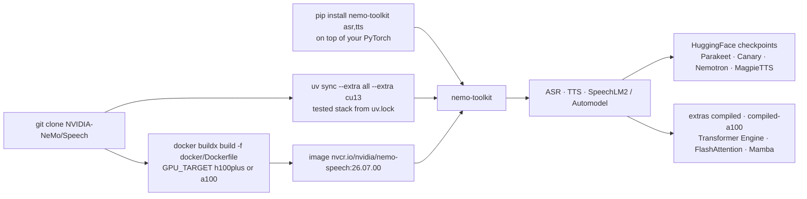

# NVIDIA-NeMo/Speech

> **PyTorch toolkit to train and serve speech models: ASR, TTS and speech LLMs.**

## The problem

Working on speech recognition, speech synthesis or audio multimodal LLMs means assembling the
architectures, the training recipes, the checkpoint loading and the inference path yourself —
plus the streaming and latency question on top. Each brick exists, but making them agree on one
given Python/PyTorch/CUDA stack is work to redo on every project.

## What it actually does

The README describes a repository aimed at researchers and PyTorch developers working on speech
models: automatic speech recognition (ASR), text to speech (TTS) and speech LLMs. It is meant to
create, customize and deploy models by reusing existing code and pre-trained checkpoints.

- **Narrowed scope.** Since 2026 this repository focuses on audio, speech and multimodal LLMs;
  the last NeMo release before the repository split, with the other modalities, is v2.7.3. The
  current announced release is 3.0.0.
- **Model families named**: Parakeet (including `parakeet-unified-en-0.6b`, offline and streaming
  in one model, minimum announced latency 160 ms), Canary and Canary-Qwen-2.5B,
  Nemotron-3.5-ASR-Streaming-0.6B (40 languages, latency tunable from 80 ms to 1 s), multilingual
  MagpieTTS (12 languages in v2607), and Nemotron 3 VoiceChat in early access.
- **Your stack, your choice.** The README insists on one point: Python ≥ 3.12 and PyTorch ≥ 2.7,
  but the `pip` install sits *on top of* the existing stack without replacing it. The versions
  pinned in `uv.lock` (Python 3.13, PyTorch 2.11/CUDA 12.9 or 2.12/CUDA 13.2) are the tested
  combinations, not a hard requirement.
- **Domain extras**: `asr`, `tts`, plus `cu12`/`cu13` for the CUDA stack, `all`, `compiled` and
  `compiled-a100` for the accelerated kernels.

The technical documentation itself is not in the README: it is deferred to the online NeMo Speech
developer documentation, per version.

## How it is wired

No diagram derived from the code exists for this repository: this graph is rebuilt from the
README alone, from the install paths, the extras and the artifacts it names.



## Try it

The three documented paths, copied from the README. From source with `uv`, the recommended one:

```bash
git clone https://github.com/NVIDIA-NeMo/Speech.git
cd Speech
uv sync --extra all --extra cu13     # CUDA 13.x (recommended) — use --extra cu12 for CUDA 12.x
```

From the prebuilt container:

```bash
docker pull nvcr.io/nvidia/nemo-speech:26.07.00
docker run --rm -it --gpus all -v "$PWD:/workspace" nvcr.io/nvidia/nemo-speech:26.07.00 bash
```

Or on top of an already-installed PyTorch stack:

```bash
uv pip install 'nemo-toolkit[asr,tts]'   # or plain: pip install 'nemo-toolkit[asr,tts]'
```

The README gives no inference or training code example: it points to the online developer
documentation and to the HuggingFace collection for demos.

## Cost and traps

- **The GPU.** An NVIDIA GPU + CUDA is required for training and recommended for inference. The
  announced concurrency figures (240 to 2400 simultaneous streams for
  Nemotron-3.5-ASR-Streaming) are given on 1×H100: that is the class of hardware targeted.
- **`uv sync --locked` overwrites your stack.** The README warns explicitly: on a bring-your-own
  environment it applies `uv.lock` and replaces Python/PyTorch/CUDA with the supported baseline.
  Use `uv pip`/`pip` in that case.
- **`weights_only`.** Since PyTorch 2.6, `torch.load` defaults to `weights_only=True`; some
  checkpoints require `TORCH_FORCE_NO_WEIGHTS_ONLY_LOAD=1`, which the README only recommends for
  trusted files — otherwise there is a risk of arbitrary code execution.
- **`cu12` and `cu13` are mutually exclusive** on Linux: pass exactly one.
- **Wheel indexes must be passed by hand**: `pip`/`uv pip` do not read the project's index
  config, hence the mandatory `--extra-index-url` for the pinned PyTorch stack.
- **Dependence on NVIDIA registries.** The turnkey images come from NGC, the checkpoints from
  HuggingFace, and VoiceChat goes through `build.nvidia.com` in early access on application: the
  code is Apache-2.0, the artifact supply chain is not.

## What it is not

- **Not a turnkey transcription API.** No service to call, no HTTP endpoint: it is a Python
  library to install, with its CUDA stack.
- **Not the whole of NeMo.** The repository was split and refocused on audio, speech and
  multimodal LLMs; the other modalities stop at v2.7.3.
- **Not installable without thinking about versions**: the README spends most of its space
  distinguishing "reproduce our stack" from "keep yours", and the two paths do not mix.
- **Nemotron 3 VoiceChat is not available**: early access on application, not an open weight to
  download.
- **The README puts no figures on cost or on the VRAM needed per model**, nor on performance
  beyond the WER and latencies quoted in the release notes.

## Alternatives

| | When to prefer it |
|---|---|
| **speechbrain/speechbrain** | Same niche: a PyTorch speech toolkit, training recipes included. Prefer it for academic work or a PyTorch stack free of CUDA/NGC constraints, at the price of smaller and less multilingual checkpoints. |
| **modelscope/FunASR** | Worth a look if the need is production-side ASR, notably on Asian languages, with models served more directly rather than a full training framework. |
| **netease-youdao/EmotiVoice** | Relevant only if the need is limited to expressive speech synthesis: a far narrower scope than the ASR/TTS/SpeechLM triptych of NeMo Speech. |
| **denizsafak/abogen** | Not comparable: an audio-reading application, not a modelling framework. Listed here only because it appears in the catalogue's lexical neighbourhood. |

## For you

This is the reference base on the NVIDIA side for anything speech-related, and the models named
(Parakeet, Canary, Nemotron-Speech-Streaming) are the ones that show up in open ASR comparisons —
worth adopting if a transcription or synthesis project lands on the table and a GPU is available.
Frame the stack question from the start though: the README says your PyTorch version is
preserved, but one wrong command (`uv sync --locked`) replaces it. For a one-off transcription
with no training, the HuggingFace checkpoints are enough and the repository is not needed.
