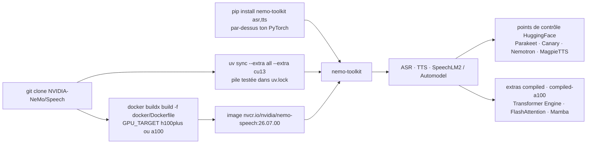

# NVIDIA-NeMo/Speech

> **Boîte à outils PyTorch pour entraîner et servir des modèles de parole : ASR, TTS, LLM audio.**

## Le problème

Travailler sur la reconnaissance de la parole, la synthèse vocale ou les LLM multimodaux audio
suppose d'assembler soi-même les architectures, les recettes d'entraînement, le chargement des
points de contrôle et la chaîne d'inférence — avec en plus la question du streaming et de la
latence. Chacune de ces briques existe, mais leur mise en cohérence sur une pile
Python/PyTorch/CUDA donnée est un travail à refaire à chaque projet.

## Ce que ça fait vraiment

Le README décrit un dépôt destiné aux chercheurs et développeurs PyTorch travaillant sur des
modèles de parole : reconnaissance automatique (ASR), synthèse (TTS) et LLM de parole. Il sert à
créer, personnaliser et déployer des modèles en réutilisant du code et des points de contrôle
pré-entraînés.

- **Périmètre recentré.** Depuis 2026, ce dépôt est dédié à l'audio, la parole et les LLM
  multimodaux ; la dernière version NeMo avant la scission du dépôt, avec les autres modalités,
  est la v2.7.3. La version courante annoncée est la 3.0.0.
- **Familles de modèles citées** : Parakeet (dont `parakeet-unified-en-0.6b`, offline et
  streaming dans un même modèle, latence minimale annoncée 160 ms), Canary et Canary-Qwen-2.5B,
  Nemotron-3.5-ASR-Streaming-0.6B (40 langues, latence réglable de 80 ms à 1 s), MagpieTTS
  multilingue (12 langues en v2607), et Nemotron 3 VoiceChat en accès anticipé.
- **Pile au choix.** Le README insiste sur un point : Python ≥ 3.12 et PyTorch ≥ 2.7, mais
  l'installation par `pip` se pose *par-dessus* la pile existante sans la remplacer. Les
  versions figées dans `uv.lock` (Python 3.13, PyTorch 2.11/CUDA 12.9 ou 2.12/CUDA 13.2) sont
  les combinaisons testées, pas une exigence.
- **Extras par domaine** : `asr`, `tts`, plus `cu12`/`cu13` pour la pile CUDA, `all`, `compiled`
  et `compiled-a100` pour les noyaux accélérés.

La documentation technique elle-même n'est pas dans le README : elle est renvoyée vers la
documentation développeur NeMo Speech en ligne, par version.

## Comment c'est branché

Aucun diagramme tiré du code n'existe pour ce dépôt : ce schéma est reconstruit depuis le seul
README, à partir des voies d'installation, des extras et des artefacts qu'il nomme.



## Essayer

Les trois voies documentées, copiées du README. Depuis les sources avec `uv`, la voie
recommandée :

```bash
git clone https://github.com/NVIDIA-NeMo/Speech.git
cd Speech
uv sync --extra all --extra cu13     # CUDA 13.x (recommended) — use --extra cu12 for CUDA 12.x
```

Par conteneur prêt à l'emploi :

```bash
docker pull nvcr.io/nvidia/nemo-speech:26.07.00
docker run --rm -it --gpus all -v "$PWD:/workspace" nvcr.io/nvidia/nemo-speech:26.07.00 bash
```

Ou par-dessus une pile PyTorch déjà installée :

```bash
uv pip install 'nemo-toolkit[asr,tts]'   # or plain: pip install 'nemo-toolkit[asr,tts]'
```

Le README ne donne aucun exemple de code d'inférence ou d'entraînement : il renvoie à la
documentation développeur en ligne et à la collection HuggingFace pour les démonstrations.

## Coût et pièges

- **Le GPU.** Un GPU NVIDIA + CUDA est requis pour l'entraînement et recommandé pour
  l'inférence. Les chiffres de concurrence annoncés (240 à 2400 flux simultanés pour
  Nemotron-3.5-ASR-Streaming) sont donnés sur 1×H100 : c'est l'ordre de grandeur du matériel visé.
- **`uv sync --locked` écrase ta pile.** Le README met explicitement en garde : sur un
  environnement « bring your own versions », il remplace Python/PyTorch/CUDA par la
  baseline supportée. Utiliser `uv pip`/`pip` dans ce cas.
- **`weights_only`.** Depuis PyTorch 2.6, `torch.load` utilise `weights_only=True` ; certains
  points de contrôle exigent `TORCH_FORCE_NO_WEIGHTS_ONLY_LOAD=1`, ce que le README ne recommande
  que pour des fichiers de confiance — sinon, risque d'exécution de code arbitraire.
- **`cu12` et `cu13` sont exclusifs** sur Linux : exactement un des deux.
- **Les index de roues sont à passer à la main** : `pip`/`uv pip` ne lisent pas la configuration
  d'index du projet, d'où le `--extra-index-url` obligatoire pour la pile PyTorch figée.
- **Dépendance aux registres NVIDIA.** Les images prêtes à l'emploi viennent de NGC, les points
  de contrôle de HuggingFace, et VoiceChat passe par `build.nvidia.com` en accès anticipé sur
  candidature : le code est Apache-2.0, la chaîne d'approvisionnement des artefacts ne l'est pas.

## Ce que ce n'est pas

- **Ce n'est pas une API de transcription clé en main.** Pas de service à appeler, pas de point
  d'entrée HTTP : c'est une bibliothèque Python à installer, avec sa pile CUDA.
- **Ce n'est pas la totalité de NeMo.** Le dépôt a été scindé et recentré sur l'audio, la parole
  et les LLM multimodaux ; les autres modalités s'arrêtent à la v2.7.3.
- **Ce n'est pas installable sans réfléchir à ses versions** : le README consacre l'essentiel de
  sa place à distinguer « reproduire notre pile » de « garder la tienne », et les deux chemins ne
  se mélangent pas.
- **Nemotron 3 VoiceChat n'est pas disponible** : accès anticipé sur candidature, pas un poids
  ouvert qu'on télécharge.
- **Le README ne chiffre ni les coûts, ni la VRAM nécessaire par modèle**, ni les performances
  hors les WER et latences cités dans les annonces de sortie.

## Alternatives

| | Quand le préférer |
|---|---|
| **speechbrain/speechbrain** | Même créneau : boîte à outils PyTorch pour la parole, recettes d'entraînement comprises. À préférer pour un travail académique ou une pile PyTorch libre de contraintes CUDA/NGC, au prix de points de contrôle moins gros et moins multilingues. |
| **modelscope/FunASR** | À regarder si le besoin est l'ASR côté production, notamment sur les langues asiatiques, avec des modèles servis plus directement plutôt qu'un cadre d'entraînement complet. |
| **netease-youdao/EmotiVoice** | Pertinent seulement si le besoin se limite à la synthèse vocale expressive : périmètre bien plus étroit que le triptyque ASR/TTS/SpeechLM de NeMo Speech. |
| **denizsafak/abogen** | Non comparable : outil applicatif de lecture audio, pas un cadre de modélisation. Cité ici uniquement parce qu'il figure dans le voisinage lexical du catalogue. |

## Pour toi

C'est le socle de référence côté NVIDIA pour tout ce qui touche à la parole, et les modèles
cités (Parakeet, Canary, Nemotron-Speech-Streaming) sont ceux qu'on retrouve dans les
comparatifs ASR ouverts — à adopter si un projet de transcription ou de synthèse arrive sur la
table et qu'un GPU est disponible. À cadrer en revanche dès le départ sur la pile : le README
dit que ta version de PyTorch est préservée, mais une seule commande mal choisie
(`uv sync --locked`) la remplace. Pour une simple transcription ponctuelle sans entraînement, les
points de contrôle HuggingFace suffisent et le dépôt n'est pas nécessaire.
