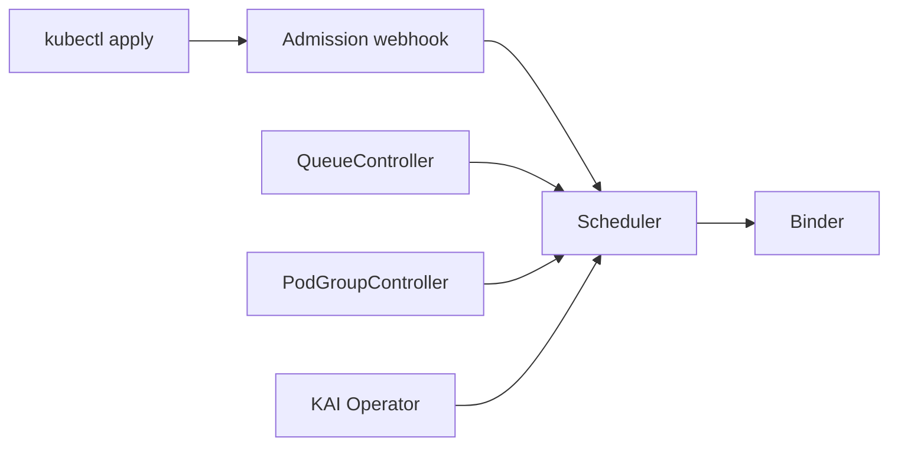

# NVIDIA/KAI-Scheduler

> Ordonnanceur Kubernetes qui répartit les GPU entre charges d'IA, pour administrateurs de grands clusters.

## Le problème
L'ordonnanceur Kubernetes standard partage mal des GPU chers entre équipes : fragmentation, files d'attente, pas d'équité.

## Ce que ça fait vraiment
Ordonnancement par groupe (gang), bin-packing ou étalement, files hiérarchiques avec quotas et équité (DRF, historique d'usage), préemption, consolidation, charges élastiques, partage de GPU, DRA et placement selon la topologie. Il cohabite avec d'autres ordonnanceurs. Construit à partir de kube-batch.

## Comment c'est branché


## Essayer
```bash
helm upgrade -i kai-scheduler oci://ghcr.io/kai-scheduler/kai-scheduler/kai-scheduler -n kai-scheduler --create-namespace --version <VERSION>
```

## Coût et pièges
Demande un cluster Kubernetes, Helm et le GPU Operator NVIDIA. Ne pas soumettre de charges dans le namespace `kai-scheduler`. Réglages spécifiques pour OpenShift.

## Ce que ce n'est pas
Pas un outil pour un poste seul ni pour un petit cluster : la valeur apparaît avec beaucoup de GPU partagés. Ce n'est pas un moteur d'entraînement.

## Alternatives
- kube-batch : la base dont KAI est issu, plus simple si tu n'as besoin que du gang scheduling.

## Pour toi
À surveiller : pertinent en MLOps sur cluster GPU partagé ; sinon inutile, et la licence n'est pas déclarée dans le catalogue.
