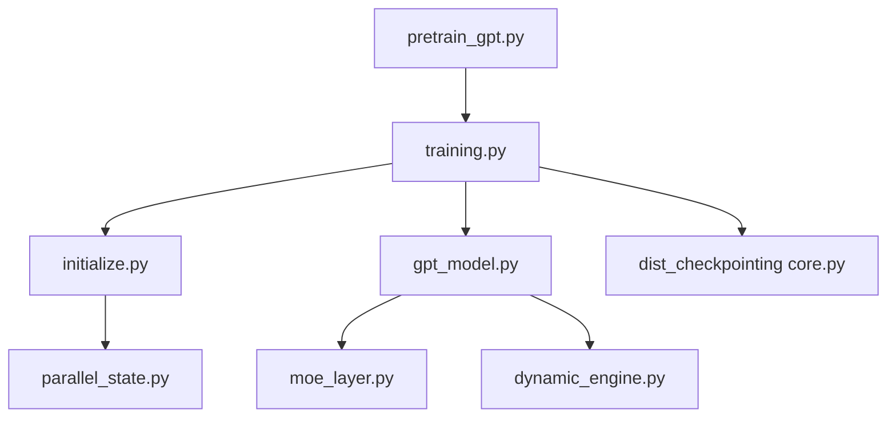

# NVIDIA/Megatron-LM

> Bibliothèque NVIDIA pour entraîner des transformers à grande échelle sur des grappes de GPU.

## Le problème
Entraîner un modèle de plusieurs milliards de paramètres demande de découper calcul, mémoire et états sur des centaines de GPU. PyTorch seul n'offre pas ces briques.

## Ce que ça fait vraiment
Megatron Core fournit les blocs transformer, MoE et les parallélismes TP, PP, DP, EP et CP, avec FP16, BF16, FP8 et FP4.
Megatron-LM ajoute des scripts d'entraînement de référence (`pretrain_gpt.py`, `train_rl.py`).
Checkpoints distribués et resharding, moteur d'inférence dynamique avec serveur de style OpenAI, export vers TensorRT-LLM.
Le README cite 47 % de MFU sur des H100 ; la mesure est faite sans aller jusqu'à la convergence.

## Comment c'est branché


## Essayer
```bash
uv pip install megatron-core
git clone https://github.com/NVIDIA/Megatron-LM.git
cd Megatron-LM
uv pip install -e .
MAX_JOBS=4 uv pip install -e .
```

## Coût et pièges
Il faut des GPU NVIDIA, et le vrai bénéfice n'arrive qu'en multi-nœuds. La compilation depuis les sources consomme beaucoup de mémoire.

## Ce que ce n'est pas
Ce n'est pas un outil de fine-tuning léger pour une seule carte. Ce n'est pas un moteur de service grand public : l'inférence est secondaire. GitHub n'identifie pas la licence.

## Alternatives
Le README ne nomme aucun dépôt concurrent. Il renvoie seulement à Megatron Bridge pour la conversion depuis et vers Hugging Face.

## Pour toi
À surveiller : c'est la référence du pré-entraînement distribué, mais sans grappe GPU tu n'as rien à en tirer au quotidien.
