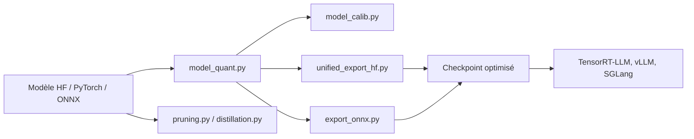

# NVIDIA/Model-Optimizer

> Bibliothèque Python NVIDIA pour quantifier, élaguer, distiller et exporter des modèles vers l'inférence.

## Le problème
Un LLM ou un modèle de diffusion en pleine précision coûte cher en mémoire et en latence ; enchaîner soi-même quantification, calibration et export vers le moteur d'inférence est fastidieux.

## Ce que ça fait vraiment
Prend un modèle Hugging Face, PyTorch ou ONNX et applique via des API Python composables : quantification post-entraînement (taille ÷2 à ÷4 selon le README), QAT, élagage, NAS, distillation, décodage spéculatif, sparsité.
Calibration, couches quantifiées, autocast ONNX ; export unifié Hugging Face (transformers et diffusers), ONNX, TensorRT-LLM.
Checkpoints pour SGLang, TensorRT-LLM, TensorRT ou vLLM ; collection de checkpoints pré-quantifiés sur Hugging Face.
Branché sur Megatron-Bridge, Megatron-LM et HF Accelerate ; skills fournis pour Claude Code et Codex.

## Comment c'est branché


## Essayer
```bash
pip install -U nvidia-modelopt[all]
git clone git@github.com:NVIDIA/Model-Optimizer.git
cd Model-Optimizer
pip install -e .[dev]
claude plugin marketplace add https://github.com/NVIDIA/Model-Optimizer.git
claude plugin install modelopt@modelopt
```

## Coût et pièges
Gratuit, mais pensé pour l'écosystème NVIDIA : GPU et conteneurs `nvcr.io` aux licences propres. L'installation tire des logiciels tiers dont le README demande de relire les licences.

## Ce que ce n'est pas
Pas un moteur d'inférence : il produit le checkpoint, le service reste à vLLM, SGLang ou TensorRT-LLM.
Pas stable : version 0.x, fonctions dépréciées retirées après une release (~1 mois), changements cassants possibles en version mineure.

## Alternatives
Aucune alternative nommée dans le README.

## Pour toi
À adopter si tu sers des LLM sur GPU NVIDIA avec vLLM ou TensorRT-LLM ; épingle la version.
