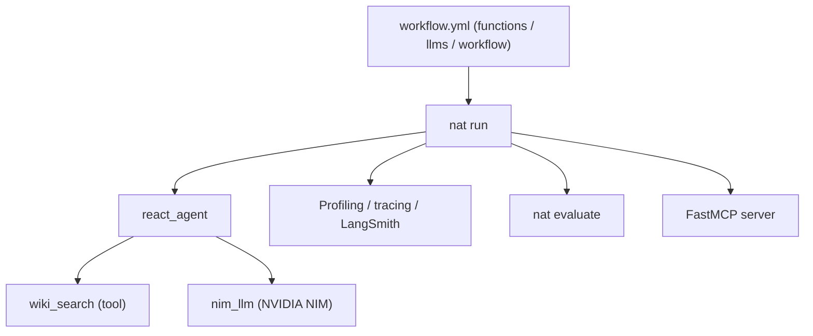

# NVIDIA/NeMo-Agent-Toolkit

> Couche d'instrumentation, d'observabilité et d'optimisation à poser sur des agents déjà écrits.

## Le problème
Un agent en production est une boîte noire : on ne sait ni où passent les tokens, ni pourquoi
une étape traîne, ni si une modification a amélioré quoi que ce soit.

## Ce que ça fait vraiment
Se branche à côté du framework existant — LangChain, LlamaIndex, CrewAI, Semantic Kernel,
Google ADK, ou du Python nu — pour profiler le workflow du niveau agent jusqu'au token,
tracer l'exécution et évaluer hors ligne. Ajoute un optimiseur d'hyperparamètres et de
prompts, du fine-tuning par renforcement, une intégration LangSmith native, la publication
d'un workflow en serveur MCP via FastMCP, et des « Agent Performance Primitives » (exécution
parallèle, branchement spéculatif, routage par priorité). Les workflows se déclarent en YAML.

## Comment c'est branché


## Essayer
```bash
pip install nvidia-nat
pip install "nvidia-nat[langchain]"
export NVIDIA_API_KEY=<your_api_key>
nat run --config_file workflow.yml --input "List five subspecies of Aardvarks"
nat configure telemetry --status
```

## Coût et pièges
Python 3.11 à 3.13. L'exemple « Hello World » exige une clé `NVIDIA_API_KEY` obtenue en créant
un compte sur build.nvidia.com. Télémétrie : au premier `nat` interactif une invite propose
l'envoi d'événements et **accepte par défaut** si tu appuies sur Entrée ; en contexte non
interactif c'est désactivé sauf `NAT_TELEMETRY_ENABLED=true`. Le README détaille ce qui part
(nom de commande, issue, durée, code de sortie, version Python) et ce qui ne part pas.

## Ce que ce n'est pas
Ce n'est pas un framework d'agents de plus : il ne remplace pas LangChain ou CrewAI, il les
instrumente. Plusieurs briques phares sont marquées expérimentales (Dynamo, runtime
intelligence). La version 1.5.0 a changé l'installation : migration nécessaire.

## Alternatives
- LangSmith seul, si tu ne veux que le tracing et les expériences d'évaluation.
- Les frameworks cités (LangChain, CrewAI, Agno) si tu cherches à écrire l'agent, pas à le mesurer.

## Pour toi
À regarder si tu as déjà des agents en production et que le sujet est la mesure, pas l'écriture.
