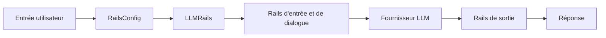

# NVIDIA/NeMo-Guardrails

> Ajoute des garde-fous programmables entre une application et son LLM, pour développeurs de chatbots et de RAG.

## Le problème
Un LLM en production peut sortir du sujet, fuiter des données ou céder aux injections de prompt sans contrôle.

## Ce que ça fait vraiment
Cinq types de rails : entrée, dialogue, récupération, exécution, sortie. Le dialogue se décrit en Colang (1.0 par défaut, 2.0 disponible), la configuration en `config.yml`, `rails.co` et `actions.py`. Vérifications de jailbreak, de faits, d'hallucination, masquage de données sensibles. API Python async-first, CLI et serveur HTTP, intégration LangChain optionnelle.

## Comment c'est branché


## Essayer
```bash
pip install nemoguardrails
nemoguardrails server [--config PATH/TO/CONFIGS] [--port PORT]
```
```python
from nemoguardrails import LLMRails, RailsConfig
rails = LLMRails(RailsConfig.from_path("PATH/TO/CONFIG"))
```

## Coût et pièges
Les appels LLM restent à ta charge (clé du fournisseur). La télémétrie anonyme est active : `DO_NOT_TRACK=1` avant le démarrage pour la couper. NVIDIA Build sert à l'évaluation uniquement.

## Ce que ce n'est pas
Les rails intégrés peuvent ne pas convenir à ton cas : le README demande de les valider. Ce n'est pas une garantie de sécurité totale.

## Alternatives
- guardrails.ai : contrôle par analyse de la sortie, cité par le README.
- LLM-Guard : garde-fous individuels, à combiner plutôt qu'à remplacer.

## Pour toi
À adopter : cadre mature pour cadrer un chatbot ou un RAG, à condition de couper la télémétrie et de vérifier la licence.
