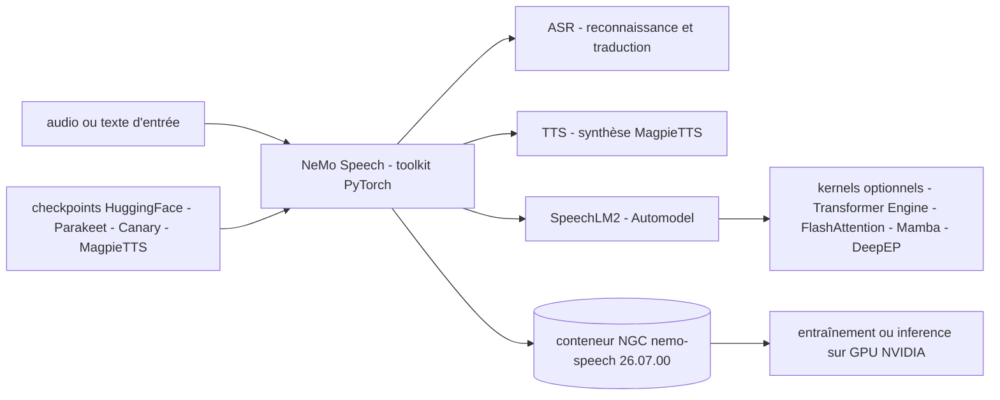

# NVIDIA/NeMo

> **NVIDIA's PyTorch toolkit for training and shipping speech models.**

## The problem

Building a speech recognition system, a synthesis voice or an audio LLM from scratch means
assembling the architecture, the training recipe, the GPU kernels and the checkpoints
yourself. Without a shared base, every team rewrites the same PyTorch plumbing and starts
from untrained weights instead of existing ones.

## What it actually does

The README presents NeMo Speech as aimed at researchers and PyTorch developers working on
ASR, TTS and Speech LLMs, to create, customize and deploy models by reusing existing code and
pre-trained checkpoints. In 2026 the repository pivoted to audio, speech and multimodal LLMs;
v2.7.3 is the last release covering other modalities, and v3.0.0 is the current one. It is the
entry point to a family of HuggingFace checkpoints named in the README: Parakeet V3 and
Canary V2 (recognition and translation for 25 European languages), Canary-Qwen-2.5B,
Nemotron-3.5-ASR-Streaming-0.6B (40 languages, controllable latency from 80 ms to 1 s),
Parakeet-unified-en-0.6b (offline and streaming in one model, 160 ms minimum latency) and
MagpieTTS v2607 (12 languages). The SpeechLM2 / Automodel backend runs without any compiled
dependency and can optionally use Transformer Engine, FlashAttention, Mamba, grouped-GEMM/MoE
or DeepEP through the `compiled` and `compiled-a100` extras.

## How it is wired



No code-derived diagram exists for this repository: the nodes above come from the README
alone. The files it names are `uv.lock` (the tested stack: Python 3.13, PyTorch 2.11 with
CUDA 12.9 or PyTorch 2.12 with CUDA 13.2), `docker/Dockerfile` with its `BASE_IMAGE` and
`GPU_TARGET` build arguments, `CONTRIBUTING.md` and `LICENSE`.

## Trying it

```bash
git clone https://github.com/NVIDIA-NeMo/Speech.git
cd Speech
uv sync --extra all --extra cu13     # CUDA 13.x (recommended) — use --extra cu12 for CUDA 12.x
```

```bash
docker pull nvcr.io/nvidia/nemo-speech:26.07.00
docker run --rm -it --gpus all -v "$PWD:/workspace" nvcr.io/nvidia/nemo-speech:26.07.00 bash
```

```bash
uv pip install 'nemo-toolkit[asr,tts]'   # or plain: pip install 'nemo-toolkit[asr,tts]'
```

To build the image from source:
`docker buildx build -f docker/Dockerfile -t nemo-speech .`

## Cost and traps

Free, but an NVIDIA GPU with CUDA is required for training and recommended for inference.
Stated minimums: Python 3.12 or above, PyTorch 2.7 or above. The README warns that
`uv sync --locked` applies `uv.lock` and **replaces** your Python/PyTorch/CUDA with the
supported baseline — to keep your own stack you must use `uv pip`/`pip`. On Linux, `cu12` and
`cu13` are mutually exclusive and exactly one must be passed. The pip `cu12`/`cu13` extras
need an explicit `--extra-index-url` pointing at `download.pytorch.org`, which pip and uv pip
do not infer. Security trap flagged by the README: since PyTorch 2.6 `torch.load` defaults to
`weights_only=True`, and some checkpoints require `TORCH_FORCE_NO_WEIGHTS_ONLY_LOAD=1` — only
safe with trusted files, otherwise arbitrary code execution is possible. Accelerated kernels
are source-built through the Dockerfile with `GPU_TARGET=h100plus` or `a100`. Nemotron 3
VoiceChat is early access only, by application.

## What it is not

It is no longer the general-purpose NeMo toolkit: the repository was split and now covers only
audio, speech and multimodal LLMs — for other modalities the README points to the frozen
v2.7.3 release. It is not a turnkey service or a hosted API: the demos and NIMs it links to
live on HuggingFace or build.nvidia.com, not in this package. It is not hardware-neutral
either: the tested stack is NVIDIA plus CUDA, and the named build targets are A100, Hopper and
Blackwell. Finally, no license appears in the catalogue metadata while the README states
Apache 2.0 — check `LICENSE` before any committing use.

## Alternatives

- **openai/whisper** — when you only need transcription from a single model with a minimal
  install, no training recipe and no customization.
- **RVC-Boss/GPT-SoVITS** — for speech synthesis and voice cloning alone, where NeMo Speech
  targets ASR, TTS and Speech LLMs in one framework.
- **huggingface/transformers** — to stay in a general multimodal ecosystem, NeMo Speech having
  become speech-specialized.

## For you

This is the base to know as soon as you train or fine-tune speech models on NVIDIA hardware:
the Parakeet, Canary and MagpieTTS checkpoints are usable directly, and the README gives
latency and language-coverage figures. Skip it if you want quick transcription without a GPU
or a CUDA stack to maintain.
