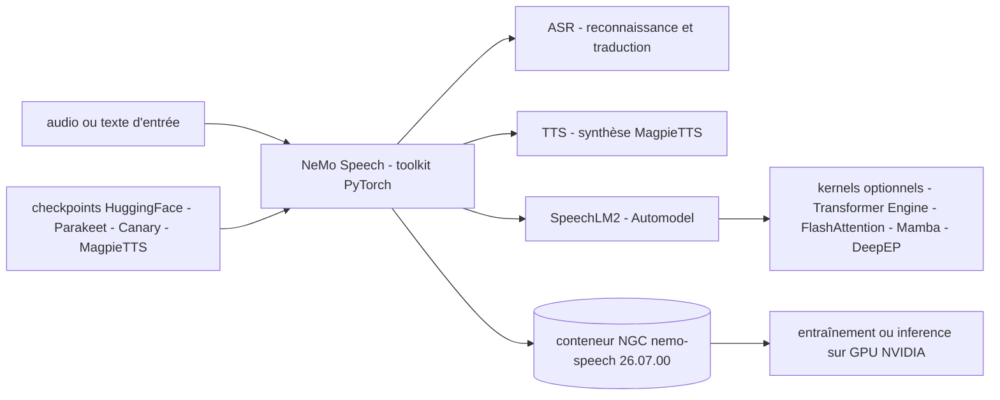

# NVIDIA/NeMo

> **Boîte à outils PyTorch de NVIDIA pour entraîner et servir des modèles de parole.**

## Le problème

Construire un modèle de reconnaissance vocale, de synthèse ou un LLM audio depuis zéro
suppose d'assembler soi-même l'architecture, la recette d'entraînement, les kernels GPU et
les checkpoints. Sans socle commun, chaque équipe réécrit la même plomberie PyTorch et repart
d'un modèle non entraîné au lieu de partir de poids existants.

## Ce que ça fait vraiment

Le README décrit NeMo Speech comme destiné aux chercheurs et développeurs PyTorch travaillant
sur l'ASR, le TTS et les Speech LLMs, pour créer, personnaliser et déployer des modèles en
réutilisant du code et des checkpoints pré-entraînés. Le dépôt a pivoté en 2026 vers l'audio,
la parole et les LLM multimodaux : la dernière version couvrant d'autres modalités est
v2.7.3, la version courante est v3.0.0. Il est le point d'entrée vers une famille de
checkpoints publiés sur HuggingFace et cités par le README : Parakeet V3 et Canary V2
(reconnaissance et traduction sur 25 langues européennes), Canary-Qwen-2.5B,
Nemotron-3.5-ASR-Streaming-0.6B (40 langues, latence réglable de 80 ms à 1 s),
Parakeet-unified-en-0.6b (hors ligne et streaming dans un seul modèle, latence minimale
160 ms) et MagpieTTS v2607 (12 langues). Le backend SpeechLM2 / Automodel fonctionne sans
aucune dépendance compilée, et peut optionnellement utiliser Transformer Engine,
FlashAttention, Mamba, grouped-GEMM/MoE ou DeepEP via les extras `compiled` et `compiled-a100`.

## Comment c'est branché



Aucun diagramme tiré du code n'existe pour ce dépôt : ces nœuds sont déduits du seul README.
Les fichiers qu'il cite sont `uv.lock` (la pile testée : Python 3.13, PyTorch 2.11/CUDA 12.9
ou PyTorch 2.12/CUDA 13.2), `docker/Dockerfile` avec ses arguments `BASE_IMAGE` et
`GPU_TARGET`, `CONTRIBUTING.md` et `LICENSE`.

## Essayer

```bash
git clone https://github.com/NVIDIA-NeMo/Speech.git
cd Speech
uv sync --extra all --extra cu13     # CUDA 13.x (recommended) — use --extra cu12 for CUDA 12.x
```

```bash
docker pull nvcr.io/nvidia/nemo-speech:26.07.00
docker run --rm -it --gpus all -v "$PWD:/workspace" nvcr.io/nvidia/nemo-speech:26.07.00 bash
```

```bash
uv pip install 'nemo-toolkit[asr,tts]'   # or plain: pip install 'nemo-toolkit[asr,tts]'
```

Pour construire l'image depuis les sources :
`docker buildx build -f docker/Dockerfile -t nemo-speech .`

## Coût et pièges

Gratuit, mais il faut un GPU NVIDIA avec CUDA : obligatoire pour l'entraînement, recommandé
pour l'inférence. Minimums annoncés : Python 3.12 ou plus, PyTorch 2.7 ou plus. Le README
avertit que `uv sync --locked` applique `uv.lock` et **remplace** votre Python/PyTorch/CUDA
par la pile de référence — pour garder son propre environnement, il faut passer par
`uv pip`/`pip`. Sur Linux, `cu12` et `cu13` sont mutuellement exclusifs, il faut en passer
exactement un. Les extras `cu12`/`cu13` en pip exigent un `--extra-index-url` explicite vers
`download.pytorch.org`, que pip et uv pip ne déduisent pas. Piège de sécurité signalé par le
README : depuis PyTorch 2.6, `torch.load` utilise `weights_only=True` et certains checkpoints
imposent `TORCH_FORCE_NO_WEIGHTS_ONLY_LOAD=1` — à ne faire que sur des fichiers de confiance,
sous peine d'exécution de code arbitraire. Les kernels accélérés se construisent depuis les
sources via le Dockerfile, avec `GPU_TARGET=h100plus` ou `a100`. Nemotron 3 VoiceChat n'est
disponible qu'en accès anticipé, sur candidature.

## Ce que ce n'est pas

Ce n'est plus la boîte à outils NeMo généraliste : le dépôt a été scindé et ne couvre plus que
l'audio, la parole et les LLM multimodaux — pour les autres modalités le README renvoie à la
version figée v2.7.3. Ce n'est pas un service clé en main ni une API hébergée : les démos et
les NIM cités vivent sur HuggingFace ou build.nvidia.com, pas dans ce paquet. Ce n'est pas
non plus un projet neutre côté matériel : la pile testée est NVIDIA + CUDA, et les cibles de
build nommées sont A100, Hopper et Blackwell. Enfin la licence n'apparaît pas dans les
métadonnées du catalogue, alors que le README annonce Apache 2.0 — à vérifier dans `LICENSE`
avant tout usage engageant.

## Alternatives

- **openai/whisper** — si le besoin est simplement de transcrire avec un modèle unique et une
  installation minimale, sans recette d'entraînement ni personnalisation.
- **RVC-Boss/GPT-SoVITS** — pour la seule synthèse vocale et le clonage de voix, là où NeMo
  Speech vise ASR, TTS et Speech LLM dans un même cadre.
- **huggingface/transformers** — pour rester dans un écosystème généraliste multi-modalités,
  NeMo Speech étant devenu spécialisé sur la parole.

## Pour toi

C'est le socle à connaître dès qu'on entraîne ou qu'on affine des modèles de parole sur du
matériel NVIDIA : les checkpoints Parakeet, Canary et MagpieTTS sont directement utilisables,
et les chiffres de latence et de couverture linguistique sont donnés dans le README. À éviter
si l'on cherche une transcription rapide sans GPU ni pile CUDA à entretenir.
