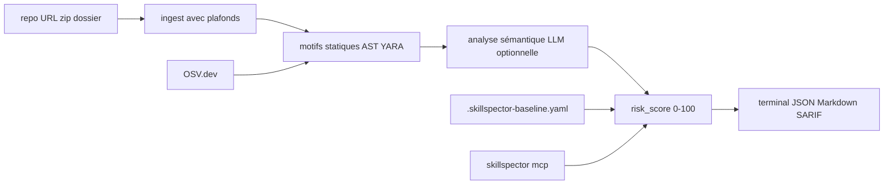

# NVIDIA/SkillSpector

> Scanner de sécurité pour les skills d'agents : il les analyse avant que tu les installes.

## Le problème
Une skill d'agent s'exécute avec une confiance implicite et presque aucune vérification préalable.
Sur le sous-ensemble analysé de 31 132 skills, 26,1 % présentent des vulnérabilités et 5,2 % une intention probablement malveillante.

## Ce que ça fait vraiment
Analyse dépôts Git, URL, zip, répertoires ou fichiers isolés, et répond à « est-ce sûr à installer ? ».
71 motifs sur 17 catégories : injection de prompt, exfiltration, escalade, chaîne d'approvisionnement, AST, taint tracking, YARA, MCP.
Deux étages : analyse statique rapide, puis évaluation sémantique par LLM en option (`--no-llm` pour s'en passer).
Score de risque 0-100 avec recommandation, sorties terminal, JSON, Markdown ou SARIF, et baseline pour les faux positifs.

## Comment c'est branché


## Essayer
```bash
uv tool install git+https://github.com/NVIDIA/skillspector.git
skillspector scan ./my-skill/
skillspector scan ./my-skill/ --no-llm --format json --output report.json
claude mcp add skillspector -- skillspector mcp
```
En conteneur : `make docker-build` puis `docker run --rm -v "$PWD:/scan" skillspector scan ./my-skill/ --no-llm`.

## Coût et pièges
L'analyse LLM demande une clé chez le fournisseur choisi (la configuration par défaut vise DeepSeek, annoncé
comme appelé à disparaître). Le transport HTTP du serveur MCP est livré sans authentification.

## Ce que ce n'est pas
Pas une garantie : un score bas issu d'un scan statique seul n'équivaut pas à un scan complet, d'où les champs `llm_used` / `scan_mode`.
Pas une signature de confiance : la publication signée relève du pipeline NVIDIA Verified Skills, pas de cet outil.
Pas un scanner généraliste de code : il cible les skills et les serveurs MCP.

## Alternatives
Aucune nommée dans le README.

## Pour toi
À mettre en garde-fou avant toute installation de skill tierce — le `--no-llm` suffit pour un premier filtre gratuit.
