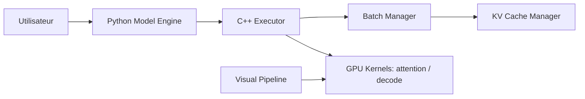

# NVIDIA/TensorRT-LLM

> Bibliothèque d'inférence pour LLM et modèles de génération visuelle sur GPU NVIDIA, avec noyaux spécialisés.

## Le problème
Servir un grand modèle sur GPU avec un bon débit demande des noyaux sur mesure et un runtime adapté (cache KV, parallélisme, décodage spéculatif).

## Ce que ça fait vraiment
Noyaux pour l'attention, les GEMM et les MoE, optimisations d'exécution (désagrégation prefill/decode, parallélisme d'experts large, décodage spéculatif) et une API Python LLM sur PyTorch, de un GPU à plusieurs nœuds. Il s'intègre à NVIDIA Dynamo et Triton. Des pipelines de génération vidéo/image sont aussi fournis.

## Comment c'est branché

## Essayer
Le README ne donne pas de commande d'installation : il renvoie au Quick Start et à l'Installation Guide de la documentation.

## Coût et pièges
GPU NVIDIA. Télémétrie anonyme activée par défaut (GPU, modèle, configuration) ; opt-out par `TRTLLM_NO_USAGE_STATS=1`, `DO_NOT_TRACK=1`, fichier `~/.config/trtllm/do_not_track` ou `--no-telemetry`. Licence présente mais non identifiée par GitHub.

## Ce que ce n'est pas
Pas un service d'inférence complet : le serveur se fait avec `trtllm-serve` ou Dynamo. Ne fonctionne pas sur d'autres GPU.

## Alternatives
NVIDIA Dynamo et Triton Inference Server (cités comme intégrations) ; AutoDeploy pour déployer des modèles PyTorch.

## Pour toi
À adopter si tu sers des LLM sur GPU NVIDIA à volume élevé ; vérifie la licence et désactive la télémétrie si nécessaire.
