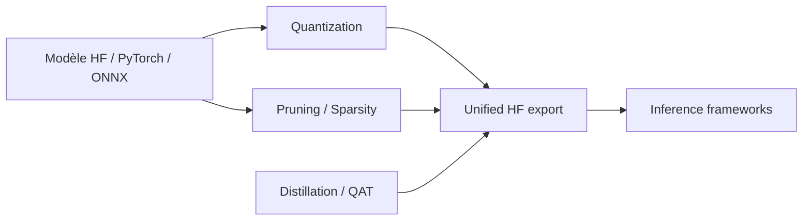

# NVIDIA/TensorRT-Model-Optimizer

> Bibliothèque de quantification, élagage, distillation et décodage spéculatif pour accélérer les modèles.

## Le problème
Un modèle trop lourd coûte cher en mémoire et en latence ; il faut le compresser sans perdre trop de qualité.

## Ce que ça fait vraiment
ModelOpt prend un modèle Hugging Face, PyTorch ou ONNX et applique quantification post-entraînement ou consciente de l'entraînement, élagage, recherche d'architecture, distillation, décodage spéculatif et parcimonie. Il exporte un checkpoint quantifié déployable sur TensorRT-LLM, vLLM, SGLang ou TensorRT. Intégration avec Megatron-Bridge, Megatron-LM et Accelerate. Des checkpoints pré-quantifiés sont sur Hugging Face.

## Comment c'est branché


## Essayer
```bash
pip install -U nvidia-modelopt[all]
```
```bash
git clone git@github.com:NVIDIA/Model-Optimizer.git
cd Model-Optimizer
pip install -e .[dev]
```

## Coût et pièges
GPU NVIDIA pour les gains attendus. L'installation télécharge des dépendances tierces dont les licences sont à relire. Avant la 1.0 : période de migration de seulement un mois après dépréciation.

## Ce que ce n'est pas
Pas un serveur d'inférence : il prépare les checkpoints. L'API évolue vite (version 0.x).

## Alternatives
Aucune alternative nommée dans le README ; TensorRT-LLM, vLLM et SGLang sont des cibles de déploiement.

## Pour toi
À adopter si tu déploies des LLM sur GPU NVIDIA et veux réduire la mémoire : c'est l'outil du même éditeur que le runtime, avec une API instable à surveiller.
