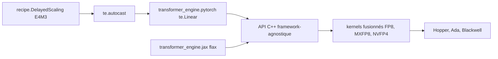

# NVIDIA/TransformerEngine

> Bibliothèque d'accélération des Transformers sur GPU NVIDIA en précisions FP8, MXFP8 et NVFP4.

## Le problème
Entraîner et servir un Transformer de grande taille sature la mémoire et le calcul.
Descendre en précision à la main suppose de gérer soi-même les facteurs d'échelle.

## Ce que ça fait vraiment
Des modules prêts (`te.Linear`, couches Transformer) qui maintiennent en interne les facteurs d'échelle FP8.
Une API de type autocast : `with te.autocast(enabled=True, recipe=fp8_recipe)` autour de la passe avant.
Une API C++ indépendante du cadriciel, pour donner le support FP8 à d'autres bibliothèques.
Intégrations existantes : Megatron-LM, NeMo, DeepSpeed, Hugging Face Accelerate, Lightning, GPT-NeoX.

## Comment c'est branché


## Essayer
```bash
pip install --no-build-isolation transformer_engine[pytorch]
```
Ou, recommandé, via le conteneur NGC :
```bash
docker run --gpus all -it --rm nvcr.io/nvidia/pytorch:26.01-py3
```

## Coût et pièges
GPU Blackwell, Hopper, Grace, Ada ou Ampere ; FP8 exige une capacité de calcul 8.9 ou plus.
La compilation de FlashAttention-2 dévore la RAM : `MAX_JOBS=1` est le contournement documenté.

## Ce que ce n'est pas
Pas un cadriciel d'entraînement : il fournit des briques, pas une boucle.
Pas portable : Linux officiellement, WSL2 en support limité, rien sans GPU NVIDIA.
Attention à la rupture v1.7 : la définition du masque de remplissage s'est inversée côté PyTorch.

## Alternatives
Aucune alternative nommée dans le README.

## Pour toi
Le bon levier si tu entraînes sur Hopper ou Blackwell ; sinon, passer par NeMo ou Megatron qui l'intègrent déjà.
