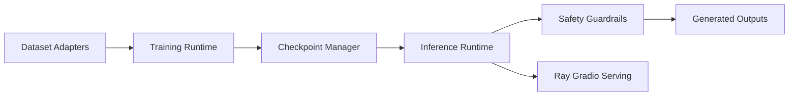

# NVIDIA/cosmos-framework

> Cadre d'entraînement et de service de modèles de monde Cosmos 3, pour équipes IA physique disposant de GPU.

## Le problème
Entraîner et servir des modèles omnimodaux (texte, image, vidéo, audio, actions) demande d'assembler parallélisme, checkpoints et backends d'inférence à la main.

## Ce que ça fait vraiment
Un paquet `cosmos_framework/` couvre l'entraînement distribué (FSDP, TP, CP, PP), les checkpoints DCP avec import/export safetensors, et l'inférence via Diffusers, Transformers ou vLLM. Il sert en batch ou en ligne (Ray + Gradio) et inclut un serveur de politique. Des skills d'agents (`.agents/skills/`) aident à l'installation et au dépannage.

## Comment c'est branché


## Essayer
```bash
sudo apt-get install -y --no-install-recommends curl ffmpeg git-lfs libx11-dev tree wget
uv sync --all-extras --group=cu130-train
source .venv/bin/activate && export LD_LIBRARY_PATH=
bash examples/launch_sft_vision_nano.sh
python -m cosmos_framework.scripts.inference \
    --parallelism-preset=latency \
    -i "inputs/omni/t2v.json" \
    -o outputs/omni_nano \
    --checkpoint-path Cosmos3-Nano \
    --seed=0
```

## Coût et pièges
Les recettes fournies sont en 8 GPU (testées sur 8× H100 80 Go). CUDA 12.8 ou 13.0 requis, et des checkpoints à télécharger. La licence n'est pas reconnue par GitHub : à lire avant tout usage commercial.

## Ce que ce n'est pas
Ce n'est pas une démo clé en main : pour essayer Cosmos 3, le README renvoie au dépôt NVIDIA/cosmos. Pas prévu pour un portable sans GPU.

## Alternatives
Le README ne nomme pas d'alternative ; il renvoie à nvidia/cosmos pour une prise en main guidée.

## Pour toi
Surveiller : utile si tu fais du fine-tuning de modèles de monde sur cluster GPU, mais la licence est à vérifier et le matériel exigé est lourd.
