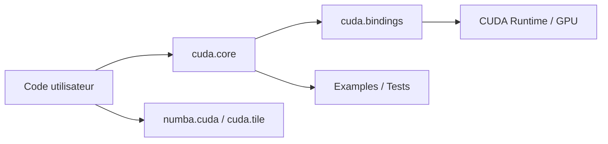

# NVIDIA/cuda-python

> Point d'entrée Python vers la plateforme CUDA : bindings bas niveau, API haut niveau, DSL de noyaux.

## Le problème
Appeler CUDA depuis Python oblige souvent à des bindings maison ou à des abstractions incompatibles entre bibliothèques.

## Ce que ça fait vraiment
Le dépôt est un métapaquet dont chaque sous-paquet est versionné seul. `cuda.bindings` couvre les API hôte (Driver, Runtime, NVRTC, nvJitLink, NVVM, cuFile, NVML). `cuda.core` offre un accès « pythonique » au runtime et au JIT. Il liste aussi cuda.compute, numba.cuda, cuda.tile, nvmath-python et des outils de profilage.

## Comment c'est branché

## Essayer
Le README ne donne aucune commande d'installation ; il renvoie à la documentation de `cuda.bindings`. Le paquet PyPI s'appelle `cuda-python`, mais ce nom ne figure pas comme commande dans le README.

## Coût et pièges
Gratuit, mais un GPU NVIDIA et un pilote CUDA sont requis. Le dépôt est en restructuration (« overhaul »).

## Ce que ce n'est pas
Pas un framework de deep learning : c'est la couche d'accès à CUDA. Certains composants listés (numba-cuda-mlir, cuda.tile) sont décrits comme nouveaux.

## Alternatives
Aucune alternative nommée dans le README.

## Pour toi
À adopter si tu écris des noyaux GPU ou des outils CUDA en Python : c'est la voie officielle de NVIDIA, activement poussée.

