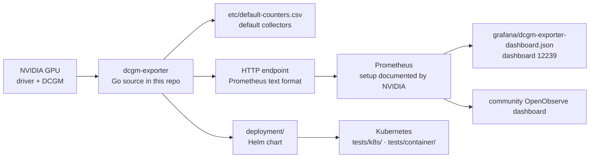

# NVIDIA/dcgm-exporter

> **Publishes NVIDIA GPU telemetry in Prometheus format, for anyone operating a GPU fleet.**

## The problem

Without it, the state of a node's GPUs — utilisation, memory, temperature, ECC errors — stays
locked inside DCGM and NVIDIA's local tooling, unreadable by a standard monitoring chain. The
usual outcome is hand-writing the bridge to Prometheus, then maintaining it through every
driver and DCGM version bump.

## What it actually does

DCGM Exporter reads counters from NVIDIA Data Center GPU Manager (DCGM) and republishes them as
Prometheus text over an HTTP endpoint. That is its whole job: a translator, not a measurement
agent of its own — the measuring stays with DCGM.

Per the README, the repository holds the exporter source, container and package builds, a Helm
chart (`deployment/`), Kubernetes end-to-end tests (`tests/k8s/`) and container tests
(`tests/container/`), the default metric collectors (`etc/default-counters.csv`) and a
checked-in Grafana dashboard (`grafana/dcgm-exporter-dashboard.json`).

One point the README stresses: each exporter release is paired with a DCGM version, and
NVIDIA's version-compatibility table is the authority, including for supported packages and
remote DCGM connections.

## How it is wired

No code-derived diagram exists for this repository; the graph below is rebuilt from the README
alone, using the resources it lists.



## Trying it

The README contains **no commands at all**: it documents neither installation, nor startup, nor
verification, and defers to NVIDIA's online documentation throughout. Nothing is invented here
to fill the gap. The entry points it names:

```bash
# No command is given in the README. It points to:
#   docs.nvidia.com/.../installation/install-dcgm-exporter.html   (deploy, verify)
#   docs.nvidia.com/.../configure-prometheus-for-dcgm-exporter.html
#   docs.nvidia.com/.../command-line-reference/dcgm-exporter.html (command options)
# and, inside the repo, deployment/README.md for the Helm chart.
```

## Cost and gotchas

- **No API key, no bill**: the code is Apache-2.0 and it runs locally.
- **An NVIDIA GPU and DCGM are mandatory**: without the NVIDIA stack installed the exporter has
  nothing to expose, and the README offers no simulated mode.
- **Version pairing is the real trap**: a whole README section says to run the exporter only
  with the DCGM version paired to that release. Upgrading driver or DCGM without upgrading the
  exporter is out of spec.
- **All operational material lives outside the repo**: deployment, configuration, available
  metrics and troubleshooting are in NVIDIA's docs, whose links are version-stamped.
- **The usual Prometheus cost applies**: per-GPU, per-container metric cardinality is paid for
  in storage, a subject the README does not touch.

## What it is not

- **Not a monitoring system.** No storage, no alerting, no UI: you need Prometheus in front and
  Grafana on top, neither of which the repo ships (only a dashboard file).
- **Not DCGM.** The measurement, the library and the hardware compatibility belong to DCGM, a
  separate project; the exporter is only its Prometheus facade.
- **Not a self-contained README**: it is a link index. Any install or configuration decision
  means opening NVIDIA's documentation, which makes the repository alone insufficient to
  evaluate the tool.

## Alternatives

| | When to prefer it |
|---|---|
| **netdata/netdata** | Catalogue neighbour, comparable only in intent: general-purpose monitoring with collection, storage and UI in one product. Prefer it when you do not want to stand up a Prometheus chain; prefer dcgm-exporter when that chain already exists and only GPUs are missing from it. |
| **openobserve/dashboards (NVIDIA GPU Monitoring)** | Named in the README: a community dashboard and integration guide for viewing the same metrics outside Grafana. |

The other neighbours (`PostHog/posthog`, `cilium/cilium`, `wekan/wekan`) are not comparable:
none deals with GPU telemetry.

## For you

Adopt it as soon as you run shared GPUs: it is the default brick for seeing whether a training
run actually saturates the card, and for charging or arbitrating fleet usage. On a single
workstation, walk past — `nvidia-smi` is enough and the Prometheus chain costs more than the
problem it solves.
