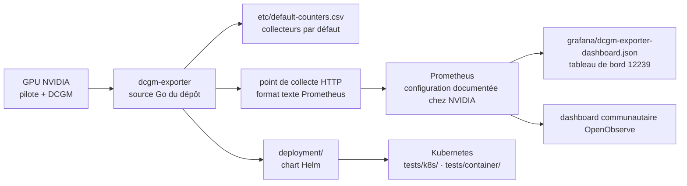

# NVIDIA/dcgm-exporter

> **Expose la télémétrie des GPU NVIDIA au format Prometheus, pour qui exploite un parc GPU.**

## Le problème

Sans lui, l'état des GPU d'un nœud — occupation, mémoire, température, erreurs ECC — reste
enfermé dans DCGM et dans des outils NVIDIA locaux, illisibles par une chaîne de supervision
standard. On finit par écrire soi-même le pont vers Prometheus, puis à le maintenir à chaque
changement de version de pilote ou de DCGM.

## Ce que ça fait vraiment

DCGM Exporter lit les compteurs de NVIDIA Data Center GPU Manager (DCGM) et les republie en
texte Prometheus sur un point de collecte HTTP. C'est tout son rôle : un traducteur, pas un
collecteur de métriques de son cru — la mesure reste faite par DCGM.

Le dépôt contient, d'après le README : la source de l'exporteur, les recettes de construction
de conteneur et de paquets, une chart Helm (`deployment/`), les tests d'intégration Kubernetes
(`tests/k8s/`) et de conteneur (`tests/container/`), la liste des collecteurs par défaut
(`etc/default-counters.csv`) et un tableau de bord Grafana versionné
(`grafana/dcgm-exporter-dashboard.json`).

Le README insiste sur un point : chaque version de l'exporteur est appariée à une version de
DCGM, et c'est le tableau de compatibilité de la documentation NVIDIA qui fait foi, y compris
pour les combinaisons de paquets et les connexions DCGM distantes.

## Comment c'est branché

Aucun diagramme tiré du code n'existe pour ce dépôt : ce schéma est reconstruit depuis le seul
README, à partir des ressources qu'il énumère.



## Essayer

Le README ne contient **aucune commande** : il ne documente ni installation, ni lancement, ni
vérification, et renvoie systématiquement à la documentation NVIDIA en ligne. Rien n'est donc
reproduit ici plutôt que reconstruit de mémoire. Les points d'entrée qu'il désigne :

```bash
# Aucune commande n'est donnée dans le README. Il renvoie à :
#   docs.nvidia.com/.../installation/install-dcgm-exporter.html   (déploiement, vérification)
#   docs.nvidia.com/.../configure-prometheus-for-dcgm-exporter.html
#   docs.nvidia.com/.../command-line-reference/dcgm-exporter.html (options de la commande)
# et, dans le dépôt, à deployment/README.md pour la chart Helm.
```

## Coût et pièges

- **Pas de clé d'API, pas de facture** : le code est sous Apache-2.0 et l'exécution est locale.
- **Un GPU NVIDIA et DCGM sont indispensables** : sans la pile NVIDIA installée, l'exporteur
  n'a rien à exposer. Le README ne donne pas de mode simulé.
- **L'appariement de versions est le vrai piège** : le README consacre une section entière à
  n'exécuter l'exporteur qu'avec la version de DCGM appariée à sa version de sortie. Une montée
  de version de pilote ou de DCGM sans montée de l'exporteur est hors spécification.
- **Toute la matière opérationnelle est hors dépôt** : déploiement, configuration, métriques
  disponibles, dépannage vivent dans la documentation NVIDIA, dont les liens sont datés par la
  version.
- **Coût d'exploitation classique du côté Prometheus** : la cardinalité des métriques par GPU
  et par conteneur se paie en stockage, sujet que le README n'aborde pas.

## Ce que ce n'est pas

- **Ce n'est pas un système de supervision.** Il n'y a ni stockage, ni alerte, ni interface :
  il faut Prometheus en face et Grafana par-dessus, que le dépôt ne fournit pas (il ne livre
  qu'un fichier de tableau de bord).
- **Ce n'est pas DCGM.** La mesure, la bibliothèque et la compatibilité matérielle appartiennent
  à DCGM, projet distinct ; l'exporteur n'en est que la façade Prometheus.
- **Ce n'est pas un README autoporteur** : c'est un index de liens. Toute décision
  d'installation ou de configuration suppose d'ouvrir la documentation NVIDIA, ce qui rend le
  dépôt seul insuffisant pour évaluer l'outil — d'où l'alerte.

## Alternatives

| | Quand le préférer |
|---|---|
| **netdata/netdata** | Voisin du catalogue, comparable seulement en intention : supervision généraliste avec collecte, stockage et interface en un seul produit. À préférer quand on ne veut pas monter une chaîne Prometheus ; dcgm-exporter à préférer quand elle existe déjà et qu'il ne manque que les GPU. |
| **openobserve/dashboards (NVIDIA GPU Monitoring)** | Cité par le README : tableau de bord communautaire et guide d'intégration pour visualiser ces mêmes métriques hors Grafana. |

Les autres voisins (`PostHog/posthog`, `cilium/cilium`, `wekan/wekan`) ne sont pas comparables :
aucun ne touche à la télémétrie GPU.

## Pour toi

À adopter dès qu'on exploite des GPU partagés : c'est la brique par défaut pour voir si un
entraînement sature vraiment la carte, et pour facturer ou arbitrer l'usage d'un parc. Sur un
poste de travail unique, passer son chemin — `nvidia-smi` suffit et la chaîne Prometheus coûte
plus cher que le problème qu'elle résout.
