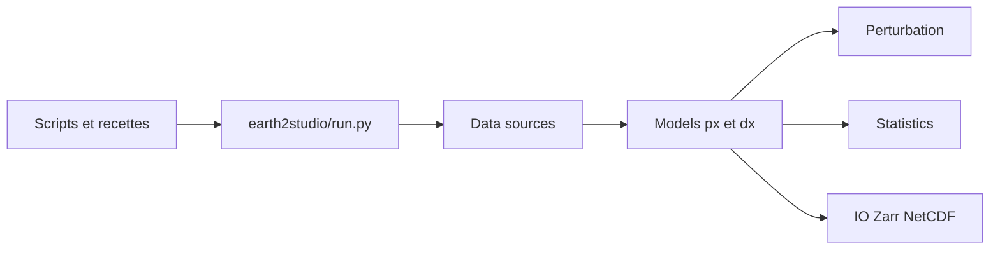

# NVIDIA/earth2studio

> Boîte à outils Python d'inférence pour modèles IA de météo et de climat, avec API unifiée.

## Le problème
Chaque modèle météo IA a ses propres entrées, données et sorties ; les comparer ou les chaîner coûte du code de liaison.

## Ce que ça fait vraiment
Fournit des modèles pronostiques (FourCastNet3, AIFS, GraphCast) et de diagnostic, des sources de données (GFS, IFS, ERA5), des perturbations pour les ensembles, des statistiques (RMSE, CRPS) et des sorties Zarr ou NetCDF. Un module `run` enchaîne source, modèle et sortie. Des skills d'agent installent et guident un premier forecast.

## Comment c'est branché


## Essayer
```bash
npx skills add NVIDIA/skills --skill earth2studio-install
```
```python
from earth2studio.models.px import FCN3
from earth2studio.data import GFS
from earth2studio.io import ZarrBackend
from earth2studio.run import deterministic as run
model = FCN3.load_model(FCN3.load_default_package())
run(["2025-01-01T00:00:00"], 10, model, GFS(), ZarrBackend("outputs/fcn3_forecast.zarr"))
```

## Coût et pièges
Données lues depuis des fournisseurs distants ; certains modèles demandent une installation propre. Les licences des modèles et jeux de données appartiennent à leurs fournisseurs : vérifier chaque droit d'usage. Besoin de GPU non chiffré dans le README.

## Ce que ce n'est pas
Ce n'est pas un modèle en soi ni un service de prévision : c'est une couche d'assemblage.

## Alternatives
Aucune alternative nommée ; l'entraînement se fait dans PhysicsNeMo, cité par le README.

## Pour toi
Surveiller : très utile si tu fais de la météo ou du climat IA, sinon domaine trop niche ; vérifie les licences de chaque modèle.

