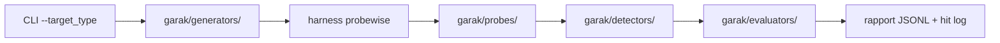

# NVIDIA/garak

> Scanner de vulnérabilités pour LLM : sonde hallucination, fuite, injection, jailbreak, toxicité.

## Le problème
Avant de mettre un LLM en production on ne sait pas par quels prompts il cède, et tester à la main ne couvre rien de reproductible.

## Ce que ça fait vraiment
Lance des familles de sondes (`probes`) contre un modèle et évalue chaque réponse avec des détecteurs.
Sondes fournies : dan, encoding, gcg, glitch, leakreplay, malwaregen, packagehallucination, promptinject, snowball, xss, entre autres.
Générateurs pour Hugging Face local ou API, OpenAI, Replicate, Cohere, Groq, ggml, REST, NIM, AWS Bedrock.
Produit `garak.log`, un rapport JSONL par run et un hit log des attaques réussies.

## Comment c'est branché


## Essayer
```bash
python -m pip install -U garak
garak --list_probes
export OPENAI_API_KEY="sk-123XXXXXXXXXXXX"
python3 -m garak --target_type openai --target_name gpt-5-nano --spec probes.encoding
```

## Coût et pièges
L'outil est gratuit mais chaque run consomme le modèle cible : dix générations par prompt par défaut, la facture API monte vite. Certains générateurs exigent une clé (OPENAI, HF_INFERENCE_TOKEN, COHERE, GROQ, NIM, BEDROCK). Python 3.11 à 3.13.

## Ce que ce n'est pas
Pas un garde-fou en production : il teste, il ne bloque rien. Pas une garantie de sécurité : un FAIL signale une faiblesse, l'absence de FAIL ne prouve rien. Les gros artefacts (modèles, corpus) vivent hors du dépôt et se téléchargent à l'usage.

## Alternatives
Le README ne cite que PromptInject, RealToxicityPrompts et Language Model Risk Cards — des travaux qu'il implémente, pas des concurrents.

## Pour toi
À installer : c'est l'outil de red-teaming LLM le plus outillé, avec un modèle de plugins simple à étendre.
