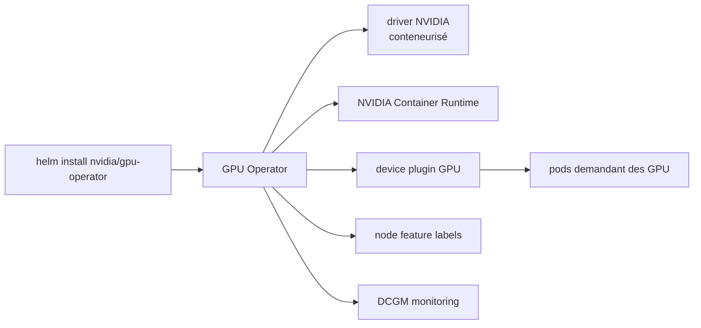

# NVIDIA/gpu-operator

> Opérateur Kubernetes qui installe et gère toute la pile logicielle NVIDIA sur les nœuds GPU.

## Le problème
Exposer un GPU dans Kubernetes exige drivers, runtime conteneur, device plugin, labels et monitoring :
beaucoup de composants à configurer, faciles à casser.
Maintenir une image d'OS spéciale pour les nœuds GPU ne passe pas l'échelle.

## Ce que ça fait vraiment
Automatise la gestion de tous les composants nécessaires au provisionnement d'un GPU : drivers NVIDIA
(pour activer CUDA), device plugin Kubernetes, NVIDIA Container Runtime, labellisation automatique
des nœuds, monitoring basé sur DCGM.
Tout tourne en conteneurs, drivers compris, donc un composant se remplace en arrêtant un conteneur.
Permet de gérer les nœuds GPU comme des nœuds CPU, avec une image d'OS standard.

## Comment c'est branché


## Essayer
```bash
helm repo add nvidia https://helm.ngc.nvidia.com/nvidia && helm repo update
helm install --wait --generate-name -n gpu-operator --create-namespace nvidia/gpu-operator
```

## Coût et pièges
Gratuit. Le cluster doit satisfaire des prérequis et figurer sur la page de support de plateformes —
les deux sont hors README. OpenShift suit une procédure distincte, documentée ailleurs.
Le README ne dit rien du cycle de mise à jour des drivers, pourtant le point sensible.

## Ce que ce n'est pas
Ce n'est pas un ordonnanceur ni un gestionnaire de quota : il rend les GPU disponibles, il ne les partage pas.
Ce n'est pas utile hors Kubernetes. Ce n'est pas indépendant du matériel NVIDIA.

## Alternatives
Aucune nommée dans le README.

## Pour toi
Le passage obligé si tu montes un cluster Kubernetes avec GPU : à coupler avec Kueue pour le quota.
