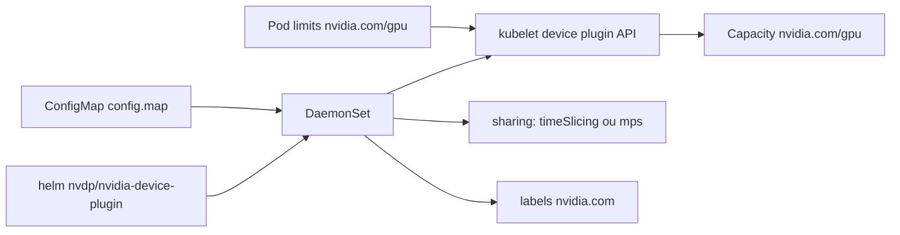

# NVIDIA/k8s-device-plugin

> DaemonSet qui expose les GPU NVIDIA d'un cluster Kubernetes comme ressources planifiables.

## Le problème
Sans lui, Kubernetes ignore les GPU d'un nœud : impossible d'en demander un dans un pod.
Et rien ne surveille leur santé.

## Ce que ça fait vraiment
Publie le nombre de GPU par nœud et permet de les demander via la ressource `nvidia.com/gpu`.
Suit la santé des GPU et porte, depuis la v0.15.0, l'implémentation des labels GPU Feature Discovery.
Gère MIG via `MIG_STRATEGY` (`none`, `single`, `mixed`) et plusieurs stratégies de passage des devices.
Permet la surcharge d'un GPU par découpage temporel CUDA ou par MPS, exclusifs l'un de l'autre.

## Comment c'est branché


## Essayer
```shell
helm repo add nvdp https://nvidia.github.io/k8s-device-plugin
helm repo update
helm upgrade -i nvdp nvdp/nvidia-device-plugin \
  --namespace nvidia-device-plugin \
  --create-namespace \
  --version 0.17.1
```

## Coût et pièges
Pilotes NVIDIA ~= 384.81, `nvidia-container-toolkit` >= 1.7.0 et runtime configuré, sur chaque nœud GPU.
Sans demande explicite de GPU, le plugin expose tous les GPU de la machine à l'intérieur du conteneur.

## Ce que ce n'est pas
Pas un ordonnanceur intelligent : dix répliques d'un GPU sont distribuées sans discernement.
Pas un partage isolé — en découpage temporel, une charge qui plante les emporte toutes.
Le support MPS reste expérimental depuis la v0.15.0 et exclut les devices MIG.

## Alternatives
Aucune alternative nommée dans le README ; les forks ne sont pas supportés.

## Pour toi
Le passage obligé pour faire tourner de l'entraînement sur un cluster ; lire d'abord la partie partage.
