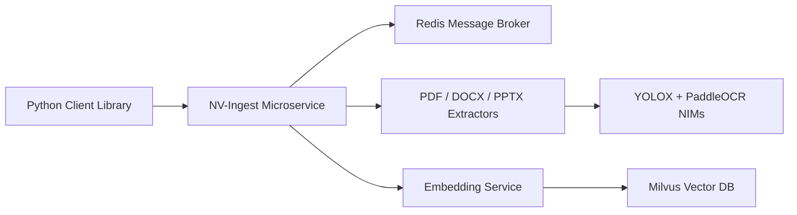

# NVIDIA/nv-ingest

> Bibliothèque NeMo Retriever d'extraction de texte, tableaux et graphiques de documents pour le RAG.

## Le problème
Les PDF contiennent tableaux et graphiques que les extracteurs texte classiques ratent.

## Ce que ça fait vraiment
Chaîne paresseuse : `create_ingestor`, `.extract()`, `.embed()`, `.vdb_upload()`, `.ingest()` qui renvoie un DataFrame. Classe les éléments de page, applique l'OCR, calcule les embeddings et les stocke dans LanceDB (Milvus dans le diagramme ancien). Petit volume : modèles Hugging Face locaux ou NIM sur build.nvidia.com ; production : Kubernetes et Helm. Le README annonce l'abandon d'anciennes API.

## Comment c'est branché


## Essayer
```python
from nemo_retriever import create_ingestor
ingestor = create_ingestor(run_mode="batch")
ingestor = ingestor.files(documents).extract().embed().vdb_upload()
chunks = ingestor.ingest()
```

## Coût et pièges
GPU NVIDIA pour les modèles locaux, ou clé NVIDIA_API_KEY pour les endpoints hébergés. La branche main peut devancer la version supportée (26.08). Sécurité et authentification à la charge de l'utilisateur.

## Ce que ce n'est pas
Pas un moteur RAG complet : il extrait et indexe. Le diagramme est antérieur au renommage NeMo Retriever.

## Alternatives
- Aucune alternative nommée dans le README.

## Pour toi
À surveiller : extraction multimodale sérieuse pour un RAG documentaire, mais liée à l'écosystème NVIDIA et à des GPU.
