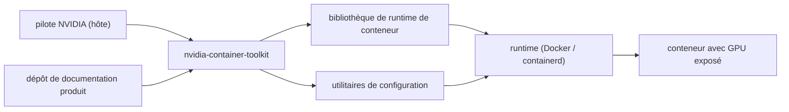

# NVIDIA/nvidia-container-toolkit

> Bibliothèque de runtime et utilitaires pour construire et exécuter des conteneurs sur GPU NVIDIA.

## Le problème
Un conteneur ne voit pas le GPU de l'hôte : il faut exposer les devices, les bibliothèques du pilote
et les variables au bon endroit, ce qui n'est pas reproductible à la main.

## Ce que ça fait vraiment
Le README tient en trois paragraphes. Le toolkit permet de construire et d'exécuter des conteneurs
accélérés par GPU. Il comprend une bibliothèque de runtime de conteneur et des utilitaires qui
configurent automatiquement les conteneurs pour qu'ils utilisent les GPU NVIDIA. Le pilote NVIDIA
doit être installé sur l'hôte ; le CUDA Toolkit, non — c'est le seul point technique explicite. Tout
le reste (aperçu d'architecture, plateformes supportées, installation, usage, options de ligne de
commande avec Docker) est renvoyé au dépôt de documentation produit.

## Comment c'est branché

## Essayer
Aucune commande documentée dans le README : il renvoie au guide d'installation et au guide
utilisateur externes.

## Coût et pièges
Gratuit. Le prérequis est le pilote NVIDIA sur l'hôte, à la bonne version — et c'est justement là
que se produisent les décalages entre hôte, toolkit et image CUDA. Le README ne donne aucune matrice
de compatibilité.

## Ce que ce n'est pas
Pas le CUDA Toolkit, explicitement : il n'a pas à être installé sur l'hôte. Pas un ordonnanceur ni un
partage de GPU : ça expose la carte au conteneur, la mutualisation est ailleurs. README sous les
800 caractères utiles : fiche minimale, rien de vérifiable dans le dépôt seul.

## Alternatives
Aucune alternative nommée dans le README.

## Pour toi
Brique obligatoire de toute stack d'entraînement conteneurisée : à installer sans réfléchir.
