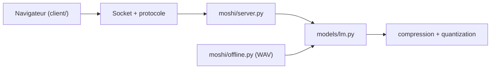

# NVIDIA/personaplex

> Modèle vocal temps réel en duplex intégral, dont on contrôle rôle et voix par prompt texte et audio.

## Le problème
Les assistants vocaux en tours de parole successifs sont lents et peu naturels, et leur persona est difficile à fixer.

## Ce que ça fait vraiment
Il ajuste l'architecture et les poids de Moshi (LLM Helium) sur des conversations synthétiques et réelles (corpus Fisher). Un serveur Python (`moshi.server`) diffuse l'audio en flux avec une interface web React ; un script hors ligne (`moshi.offline`) traite un WAV. Le persona vient d'un prompt de rôle et d'un embedding de voix (NATF/NATM, VARF/VARM).

## Comment c'est branché


## Essayer
```bash
pip install moshi/.
SSL_DIR=$(mktemp -d); python -m moshi.server --ssl "$SSL_DIR"
SSL_DIR=$(mktemp -d); python -m moshi.server --ssl "$SSL_DIR" --cpu-offload
```

## Coût et pièges
GPU requis (option `--cpu-offload` si la mémoire manque), bibliothèque Opus, jeton Hugging Face pour les poids. Étape supplémentaire pour les GPU Blackwell. Le dernier push date de mars 2026 et la licence des poids n'est pas documentée dans le README.

## Ce que ce n'est pas
Pas un simple TTS ou ASR : c'est un modèle parole-à-parole. Il est entraîné sur un rôle d'assistant fixe et des rôles de service client ; le reste dépend de la généralisation.

## Alternatives
Aucune alternative nommée dans le README (il cite Moshi comme base).

## Pour toi
À surveiller : intéressant pour prototyper un agent vocal à faible latence, mais il exige un GPU et la licence des poids reste à vérifier avant tout usage.

