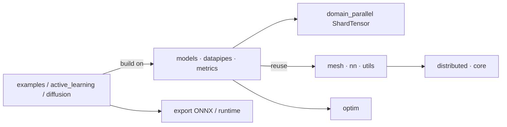

# NVIDIA/physicsnemo

> Framework PyTorch pour modèles d'IA physique, pour chercheurs en SciML et ingénieurs de simulation.

## Le problème
Les représentations scientifiques (maillages, nuages de points, grilles, champs imbriqués) ne rentrent
pas dans un pipeline PyTorch standard sans perdre leur structure.
Un échantillon haute résolution ne tient pas sur un seul GPU.

## Ce que ça fait vraiment
Composants réutilisables et recettes d'entraînement de bout en bout, en modules `torch.nn.Module`.
Familles de modèles : FNO/DPOT, MeshGraphNet/VFGN, Transolver/FLARE, GeoTransolver, DoMINO, FIGConvNet,
GLOBE et AeroJEPA (expérimentaux) ; météo-climat AFNO, GraphCast, Pangu-Weather/FengWu, DLWP ;
génératif diffusion U-Net/DiT, TopoDiff.
`ShardTensor` découpe un seul échantillon entre GPU, aux côtés de DDP et FSDP2.
Deux skills NVIDIA pour agents de code sont inclus : PhysicsNeMo Discover et ShardTensor.

## Comment c'est branché


## Essayer
```bash
pip install "nvidia-physicsnemo[cu13]"
pip install "nvidia-physicsnemo[cu12]"
pip install nvidia-physicsnemo
pip install "nvidia-physicsnemo[cu13,gnns]"
git clone https://github.com/NVIDIA/physicsnemo.git
uv sync --extra cu13
```

## Coût et pièges
Gratuit, mais orienté GPU NVIDIA : l'installation par défaut choisit le backend CUDA 13 et tire des
paquets RAPIDS. Les modules sous `physicsnemo.experimental` peuvent changer d'API entre versions.
Versions Python et contraintes exactes : lire `pyproject.toml`.

## Ce que ce n'est pas
Ce n'est pas un solveur ni un remplaçant de simulation numérique : ce sont des surrogates entraînés.
Ce n'est pas une couche applicative métier — c'est explicitement renvoyé à PhysicsNeMo CFD,
PhysicsNeMo Curator, Earth2Studio et ALCHEMI. Ce n'est pas indépendant de PyTorch.

## Alternatives
PhysicsNeMo Curator pour l'ETL scientifique, PhysicsNeMo CFD pour l'inférence et le design,
Earth2Studio pour météo et climat.

## Pour toi
Pertinent seulement si tu fais du surrogate physique ; sinon, retiens `ShardTensor` comme idée.
