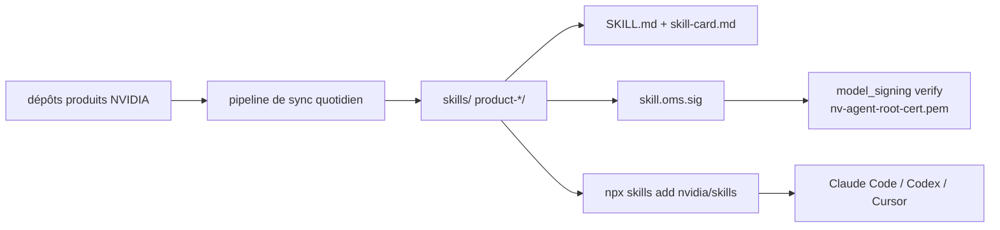

# NVIDIA/skills

> Catalogue de skills vérifiés par NVIDIA pour agents de code, pour qui utilise la pile logicielle NVIDIA.

## Le problème
Un agent de code ignore les API NVIDIA récentes et invente des appels cuOpt, DOCA ou TAO.
Rien ne garantit qu'un skill trouvé sur internet vient bien de l'éditeur.

## Ce que ça fait vraiment
Dépôt-catalogue : les skills sont maintenus dans les dépôts produits et miroités ici chaque jour
par un pipeline de synchronisation. Couvre Physical AI et robotique, simulation, bibliothèques CUDA-X,
RAG et blueprints, outils plateforme : cuDF, cuOpt, cuPyNumeric, DALI, DeepStream, DOCA, Dynamo,
Earth2Studio, Holoscan, Jetson, Megatron-Core, NeMo (AutoModel, MBridge, Relay, Retriever, RL),
Nemotron, NVFlare, PhysicsNeMo, TAO Toolkit, TileGym, VSS, Warp.
Chaque skill publié porte `SKILL.md`, `skill-card.md`, une signature OMS détachée, un jeu d'évaluation
Tier-3 et un `BENCHMARK.md` ; le pipeline écarte ceux qui manquent d'un artefact.

## Comment c'est branché


## Essayer
```bash
npx skills add nvidia/skills
npx skills add nvidia/skills --skill cuopt-numerical-optimization-api --agent claude-code --yes
npx skills update
npx skills add nvidia/skills --list
pip install model-signing
```

## Coût et pièges
Gratuit. Exige un CLI `skills` ≥ v1.5.16 : sur une version plus ancienne, un skill peut s'installer
sans apparaître dans Claude Code. Les skills sont renommés, fusionnés ou supprimés en amont —
`npx skills update` sert aussi à nettoyer les copies périmées. Les skills Physical AI sont mis en scène
manuellement, hors pipeline automatique.

## Ce que ce n'est pas
Ce n'est pas le code source des skills : c'est un miroir, la maintenance est ailleurs.
Ce n'est pas utile sans matériel ou pile NVIDIA en face. Le catalogue est en construction ouverte :
le README renvoie à une roadmap pour ce qui manque.

## Alternatives
Aucune nommée ; l'installation manuelle par copie de dossiers est décrite comme repli.

## Pour toi
À garder en signet : si tu touches cuDF, TAO ou NeMo, un skill signé vaut mieux qu'un prompt maison.
