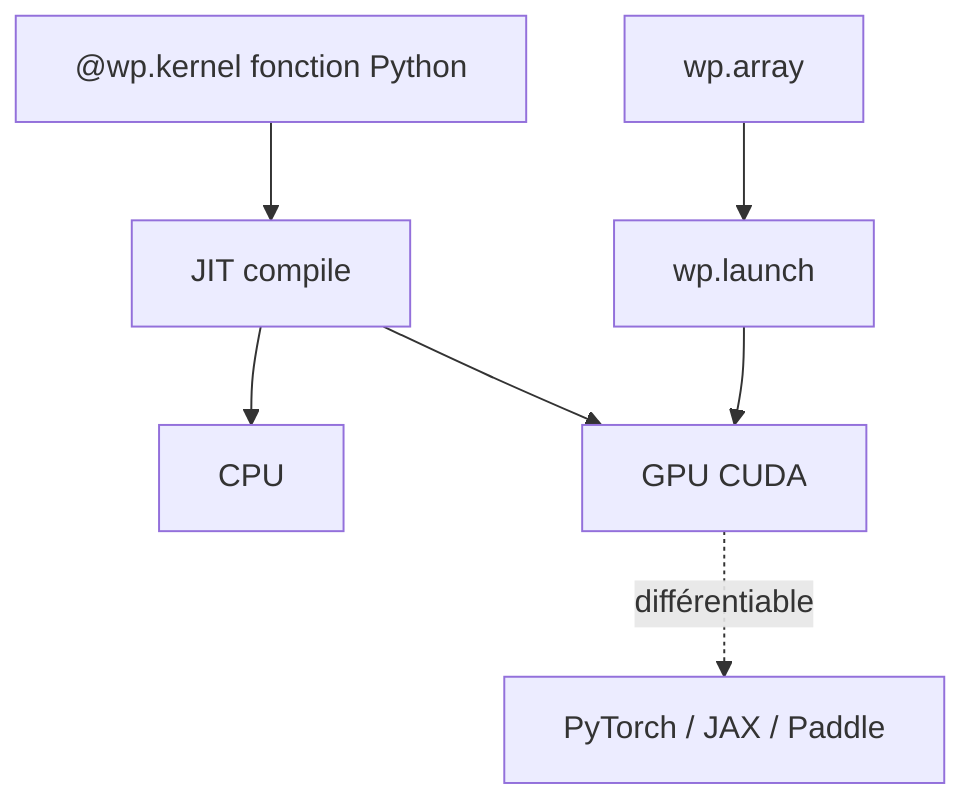

# NVIDIA/warp

> Framework Python qui JIT-compile des fonctions en kernels CPU/GPU pour la simulation et le ML.

## Le problème
Écrire des simulations physiques GPU-accélérées et différentiables oblige normalement à passer par CUDA ou des frameworks lourds. Difficile de rester en Python tout en gardant la performance kernel.

## Ce que ça fait vraiment
Décore des fonctions Python (`@wp.kernel`) et les compile en code kernel efficace exécutable sur CPU ou GPU. Fournit des primitives pour physique, robotique, géométrie. Les kernels sont différentiables et s'insèrent dans des pipelines ML (PyTorch, JAX, Paddle). Riche jeu d'exemples : FEM, optimisation, fluides, tile programming.

## Comment c'est branché


## Essayer
```text
pip install warp-lang
```
```text
python -m warp.examples.browse
```

## Coût et pièges
Gratuit. GPU NVIDIA + driver requis pour l'accélération CUDA ; pas de Metal sur macOS. libmathdx (lié statiquement) est régi par la NVIDIA Software License Agreement, distincte.

## Ce que ce n'est pas
Pas un moteur de simulation clé en main : c'est une brique bas niveau pour écrire ses propres kernels. Pas de support Metal.

## Alternatives
Non documentées dans le README (renvoie vers PyTorch/JAX comme cadres d'intégration, pas comme substituts).

## Pour toi
Pertinent si tu fais du ML avec simulation différentiable ou de la physique GPU ; sinon trop spécialisé.
