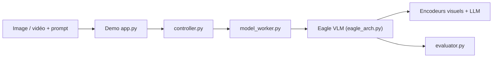

# NVlabs/Eagle

> Famille de modèles vision-langage de NVIDIA (Eagle, Eagle 2.5, LocateAnything) orientés données.

## Le problème
Comprendre images et vidéos longues, et localiser des objets, demande des modèles multimodaux entraînés avec de bonnes stratégies de données.

## Ce que ça fait vraiment
Publie des modèles : LocateAnything-3B (détection, pointage, ancrage, décodage parallèle de boîtes), Eagle 2.5 (compréhension image et vidéo longue jusqu'à 128 K), Eagle 2 et Eagle (mélange d'encodeurs). Code de démo (contrôleur, workers), d'entraînement et d'évaluation ; poids sur Hugging Face.

## Comment c'est branché


## Essayer
```bash
# Aucune commande dans le README : renvois vers les guides
# « Getting started with LocateAnything / Eagle 2.5 ».
```

## Coût et pièges
GPU nécessaire ; poids à télécharger sur Hugging Face. Certains chemins de code sont déduits de l'arbre, pas confirmés.

## Ce que ce n'est pas
Pas un service prêt à l'emploi : dépôt de recherche. Les licences des modèles dépendent de leurs bases (Qwen, Llama, Yi).

## Alternatives
- Aucune alternative citée dans le README.

## Pour toi
À surveiller : référence utile en VLM et détection open source, à tester si tu as un GPU ; les exemples ne remplacent pas un benchmark maison.

