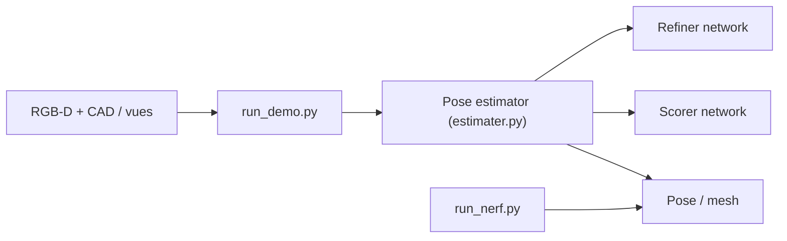

# NVlabs/FoundationPose

> Modèle de fondation pour estimer et suivre la pose 6D d'objets inconnus, pour robotique et RA.

## Le problème
Estimer la pose 6D d'un objet nouveau sans réentraîner exige d'ordinaire un modèle par objet.

## Ce que ça fait vraiment
À partir d'images RGB-D, d'une caméra et d'un modèle CAD (ou de quelques vues de référence), génère des hypothèses de pose, les affine et les note avec deux réseaux (refiner, scorer), puis passe en suivi. La voie sans modèle apprend un champ neuronal (NeRF) et reconstruit un maillage.

## Comment c'est branché


## Essayer
```bash
cd docker/
docker pull wenbowen123/foundationpose && docker tag wenbowen123/foundationpose foundationpose
bash docker/run_container.sh
bash build_all.sh
python run_demo.py
```

## Coût et pièges
GPU NVIDIA, compilation de PyTorch3D et NVDiffRast, poids et données de démo à télécharger. Les données augmentées par diffusion et leurs poids ne sont pas publiés : légère baisse de performance.

## Ce que ce n'est pas
La licence n'est pas identifiée par GitHub : à vérifier. Le classement « n° 1 BOP » date de mars 2024.

## Alternatives
- Isaac ROS Pose Estimation : version ROS avec inférence TensorRT, citée par le README.
- BundleSDF : approche sans modèle sur laquelle repose la voie few-shot.

## Pour toi
À surveiller : référence en perception 6D si tu fais de la robotique ; licence à clarifier et installation lourde.

