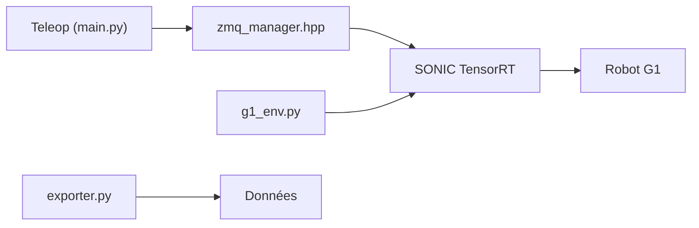

# NVlabs/GR00T-WholeBodyControl

> Contrôleurs corps entier pour robots humanoïdes (SONIC, MotionBricks, WBC découplé), de l'entraînement au déploiement.

## Le problème
Faire marcher, ramper et téléopérer un humanoïde avec une seule politique demande un pipeline complet.

## Ce que ça fait vraiment
SONIC : politique unifiée de suivi de mouvement, trois points de contrôle pour Unitree G1 (défaut, faible latence, v1.1), déploiement C++ avec TensorRT, entraînement sur Bones-SEED (142 000+ mouvements). Téléopération par casque PICO, planificateur cinématique, simulation MuJoCo. MotionBricks : aperçu, génératif temps réel.

## Comment c'est branché


## Essayer
```bash
python download_from_hf.py
cd gear_sonic_deploy
./deploy.sh --input-type zmq_manager real
pip install -e "gear_sonic/[training]"
```

## Coût et pièges
Git LFS obligatoire. Isaac Lab installé à part ; fine-tuning recommandé avec 64+ GPU. Checkpoints MotionBricks (~2,2 Gio) en option. Poids sous NVIDIA Open Model License ; licence du dépôt non identifiée par GitHub.

## Ce que ce n'est pas
Pas utilisable sans robot ou simulateur ; le README demande de tester en simulation avant le matériel.

## Alternatives
Beyond Mimic et Isaac Lab, cités comme sources du code.

## Pour toi
Référence en robotique d'apprentissage ; trop spécialisé et matériel pour un usage courant : surveiller.

