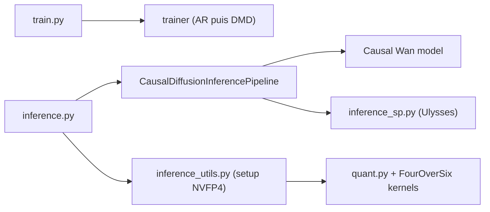

# NVlabs/LongLive

> Infrastructure NVIDIA pour entraîner et exécuter des modèles de génération vidéo longue, avec quantification NVFP4.

## Le problème
Générer des vidéos longues en temps réel exige des modèles autorégressifs rapides et économes en mémoire, difficiles à entraîner et à servir.

## Ce que ça fait vraiment
Trois générations dans un dépôt : LongLive-Plug, LongLive 1.0 (génération interactive, prompts successifs, attention sink, KV-recache) et LongLive 2.0 (entraînement et inférence parallèles, quantifiés). La 2.0 propose inférence NVFP4 (W4A4) avec cache KV NVFP4, FP8 PTQ via TorchAO, attention sink multi-plans, parallélisme de séquence et décodage asynchrone. Entraînement en deux étapes : AR teacher-forcing, puis distillation DMD.

## Comment c'est branché


## Essayer
```bash
git clone --single-branch --branch main --depth 1 https://github.com/NVlabs/LongLive.git
python inference.py --config_path configs/fp8/inference_fp8.yaml
torchrun --standalone --nnodes=1 --nproc_per_node=8 train.py --config_path configs/train_ar.yaml --logdir logs/train_ar --wandb-save-dir wandb --disable-wandb
```

## Coût et pièges
GPU récent : la pile validée est Python 3.10, PyTorch 2.8.0+cu128, TorchAO 0.13.0 sur H100, compute capability 8.9 minimum pour le FP8. Le warm-up `torch.compile` en `max-autotune` peut durer plusieurs minutes. Le clone complet embarque des ressources volumineuses.

## Ce que ce n'est pas
Pas un service ni une application : un dépôt de recherche. Les scores VBench viennent des auteurs. La plupart des variantes citées (MemFlow, ShotStream…) sont des projets tiers.

## Alternatives
- MemFlow : ajoute une mémoire adaptative pour des récits plus cohérents.
- ShotStream : génération multi-plans en streaming.
- SANA-Video (LongSANA) : variante minute avec cache KV à mémoire constante.

## Pour toi
À surveiller : intéressant pour la quantification NVFP4 et la distillation vidéo, mais il exige du matériel NVIDIA récent et reste orienté recherche.

