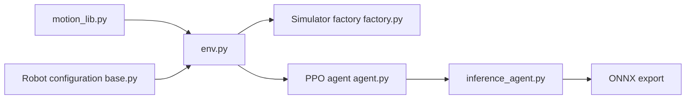

# NVlabs/ProtoMotions

> Cadre accéléré par GPU pour entraîner des humanoïdes et robots simulés, destiné aux chercheurs en RL et robotique.

## Le problème
Entraîner des personnages et robots physiques sur de grands jeux de mouvement exige de relier simulateur, données et RL, sans solution modulaire.

## Ce que ça fait vraiment
Charge des mouvements (AMASS, BONES-SEED, Kimodo), les adapte à un robot par retargeting PyRoki, entraîne des politiques (PPO, AMP, MaskedMimic) sur Isaac Gym ou Newton, teste en sim-to-sim (MuJoCo) et exporte en ONNX pour le robot Unitree G1. Annonce 12 heures sur 4 A100 pour AMASS. Environnements composés de pièces séparées (contrôle, observation, récompense).

## Comment c'est branché


## Essayer
```bash
# Aucune commande exacte dans ce README :
# voir Installation Guide et Quick Start dans la documentation.
```

## Coût et pièges
GPU NVIDIA nécessaires, plusieurs A100 pour les chiffres annoncés ; simulateurs Isaac Gym/IsaacSim à installer ; données AMASS à obtenir séparément.

## Ce que ce n'est pas
Pas un outil clé en main : un cadre de recherche. Le rendu IsaacSim cité n'est pas interactif physiquement.

## Alternatives
MimicKit (dépôt frère plus léger pour l'imitation de mouvement, cité dans le README).

## Pour toi
À surveiller : référence sérieuse si tu fais du RL pour la robotique, mais matériel et simulateurs en barrent l'accès sinon.

