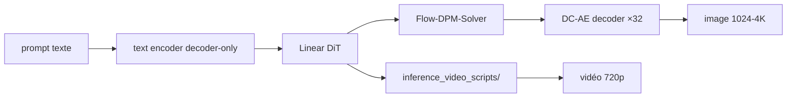

# NVlabs/Sana

> Famille de modèles de diffusion efficaces pour images et vidéos haute résolution, entraînement inclus.

## Le problème
Générer du 4K ou de la vidéo avec un modèle de diffusion classique demande des GPU serveur et des dizaines de secondes par échantillon.

## Ce que ça fait vraiment
Remplace l'attention vanilla du DiT par de l'attention linéaire, et compresse les images ×32 avec DC-AE au lieu de ×8.
Regroupe SANA, SANA-1.5, SANA-Sprint (0,1 s par image 1024 px sur H100), SANA-Video, SANA-Video 2.0 (5B et 14B), SANA-WM, SANA-Streaming et Sol-RL.
Fournit les pipelines complets d'entraînement et d'inférence, plus ControlNet, LoRA/DreamBooth et quantification 4/8 bits.
Intégré dans diffusers via `SanaPipeline`, et dans ComfyUI et SGLang.

## Comment c'est branché


## Essayer
```bash
git clone https://github.com/NVlabs/Sana.git
cd Sana && ./environment_setup.sh sana
bash inference_video_scripts/inference_sana_video.sh \
  --np 1 \
  --config configs/sana_video2/SanaVideo2_5B_720p.yaml \
  --step 50 --fps 24 --seed 4
```

## Coût et pièges
GPU obligatoire ; les chiffres de latence sont mesurés sur H100. Le déploiement laptop annoncé sous 8 Go de VRAM passe par la quantification 4 bits. Les checkpoints se téléchargent depuis Hugging Face, `diffusers>=0.32.0` requis.

## Ce que ce n'est pas
Pas un produit fini : c'est un codebase de recherche, avec des variantes à des stades différents. Le config et le checkpoint 14B de SANA-Video 2.0 ne sont pas encore inclus. Les comparaisons de latence face à Flux ou Wan sont celles des auteurs, sur leur protocole.

## Alternatives
FLUX-dev, Wan-2.1-14B et Wan-2.1-1.3B — les points de comparaison des tableaux de performance du README.

## Pour toi
À surveiller si tu génères des images ou vidéos à coût maîtrisé ; l'astuce DC-AE ×32 vaut la lecture même sans l'utiliser.
