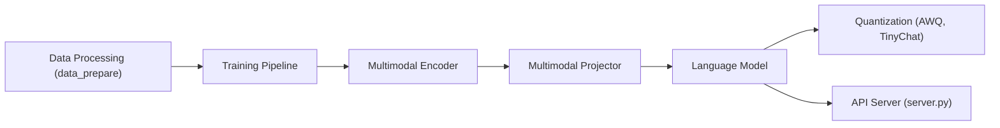

# NVlabs/VILA

> Famille de modèles vision-langage NVILA, optimisés pour comprendre vidéos et plusieurs images sur GPU et sur l'appareil.

## Le problème
Comprendre une vidéo ou plusieurs images avec un modèle multimodal coûte cher en calcul et en mémoire, surtout hors datacenter.

## Ce que ça fait vraiment
Le dépôt fournit le code d'entraînement en trois étapes (alignement, pré-entraînement sur MMC4 et Coyo, ajustement supervisé), les commandes `vila-eval` et `vila-infer`, la quantification AWQ 4 bits pour TinyChat (GPU de bureau, Jetson Orin) et TinyChatEngine (CPU), et un serveur d'API FastAPI compatible OpenAI. Les points de contrôle publiés sont NVILA-8B, NVILA-15B et leurs variantes Lite. Le README donne des tableaux de débit (jetons par seconde) sur A100, 4090 et Orin.

## Comment c'est branché


## Essayer
```bash
./environment_setup.sh vila
conda activate vila
vila-infer --model-path Efficient-Large-Model/NVILA-15B --conv-mode auto --text "Please describe the image" --media demo_images/demo_img.png
python -W ignore server.py --port 8000 --model-path Efficient-Large-Model/NVILA-15B --conv-mode auto
```

## Coût et pièges
Le README prévoit des étapes d'entraînement sur un nœud 8×A100. Le serveur d'API est réservé à l'évaluation, sans optimisation de production ; SGLang est annoncé « bientôt ». L'installation suppose Anaconda ; une étape facultative concerne un dépôt interne NVIDIA. La licence des poids n'est pas documentée dans le README.

## Ce que ce n'est pas
Ce n'est pas un simple paquet à installer par pip : c'est un dépôt de recherche avec scripts d'entraînement et d'environnement. Le README mélange VILA, NVILA, LongVILA et VILA-HD. Les débits sont ceux de NVIDIA, mesurés à batch 1 avec TinyChat.

## Alternatives
Aucune alternative citée dans le README.

## Pour toi
À surveiller : intéressant pour la compréhension vidéo sur GPU ou Jetson avec quantification, mais de recherche, lourd à entraîner, et la licence des poids reste à vérifier avant tout usage.
