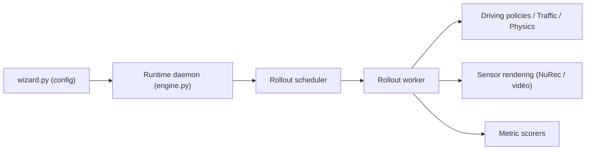

# NVlabs/alpasim

> Simulateur de recherche pour la conduite autonome, modulaire, qui teste des politiques de conduite en boucle fermée.

## Le problème
Valider une politique de conduite de bout en bout demande de simuler capteurs, dynamique du véhicule et trafic, ce que les jeux de données statiques ne permettent pas.

## Ce que ça fait vraiment
Un runtime orchestre des rollouts en boucle fermée (planificateur, workers, boucle d'événements) et appelle des services gRPC interchangeables : politique de conduite, trafic, physique du véhicule, contrôleur et rendu capteur (NuRec par défaut, OmniDreams via FlashDreams). Des scorers évaluent et agrègent les résultats ; les logs ASL peuvent être rejoués. Politiques prises en charge : Alpamayo-R1, Alpamayo 1.5, VaVAM, Transfuser (provisoire).

## Comment c'est branché

## Essayer
Le README ne contient pas de commande : il renvoie au Tutorial (Docker Compose, mono-machine) et à `src/tools/run-on-slurm` pour un cluster.

## Coût et pièges
Docker et GPU pour le rendu et les politiques. Les jeux de données NuRec viennent de Hugging Face et les artefacts d'exemple de Git LFS. Aucune exigence matérielle chiffrée dans le README.

## Ce que ce n'est pas
Pas un simulateur prêt pour la certification : c'est un banc de recherche, avec des politiques marquées « provisoire ». Hors conduite autonome, il n'a pas d'usage.

## Alternatives
Aucune alternative nommée dans le README.

## Pour toi
À surveiller : référence d'architecture de simulation en microservices gRPC, utile seulement si tu travailles sur la conduite autonome ou l'évaluation de politiques.

