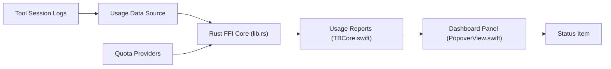

# Nanako0129/TokenBar

> Ancienne version de l'application macOS de suivi de tokens et quotas, devenue Syrtis.

## Le problème
Même besoin que Syrtis : voir ce que consomment vos agents de code IA, sans tableau de bord commun.

## Ce que ça fait vraiment
Elle lit les journaux locaux de 25+ agents et affiche tokens, coûts et quota restant dans la barre de menus, avec un chat qui court plus vite quand la consommation monte. Sept vues (Models, Monthly, Daily, Hourly, Stats, Agents, Settings), cartes de quota OAuth et graphe 3D. Cœur Rust (`tb_core_ffi`), interface Swift.

## Comment c'est branché


## Essayer
```bash
brew install --cask nanako0129/tokenbar/tokenbar
make
make run
swift run TokenBar --smoke
```

## Coût et pièges
Gratuit. Application signée ad hoc mais non notarisée : le cask retire l'attribut de quarantaine à l'installation, comme le README le dit. Mac Apple Silicon, macOS 14 minimum.

## Ce que ce n'est pas
Pas la version suivie : le README de Syrtis indique que l'app s'appelait TokenBar jusqu'à la 2.0. Le dépôt semble parallèle (poussé le 17 septembre 2026, contre le 28 pour Syrtis), sans statut clair dans la matière fournie.

## Alternatives
- Syrtis (Nanako0129/syrtis) : successeur, signé et notarisé.
- tokscale : moteur dont les deux dérivent.

## Pour toi
À ignorer au profit de Syrtis : même code de base, mais non notarisé, avec une désactivation de la quarantaine à l'installation.

