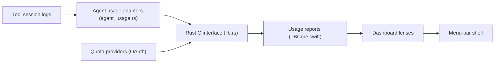

# Nanako0129/syrtis

> Application macOS de barre de menus qui affiche tokens, coûts et quotas de vos outils de code IA.

## Le problème
Les outils de code IA (Claude Code, Codex, Cursor, Gemini CLI…) consomment des tokens et des quotas d'abonnement sans tableau de bord commun.

## Ce que ça fait vraiment
Elle lit les journaux de session que les outils écrivent déjà sur disque (25+ outils), sans télémétrie, sans compte ni synchronisation cloud. Le cœur Rust (`tokscale-core`, en sous-module, plus `crates/tb_core_ffi` pour les quotas) analyse, agrège et chiffre ; Swift gère les vues, l'`NSStatusItem` et les mises à jour Sparkle. Huit vues : Overview, Quota, Models, Monthly, Daily, Hourly, Stats, Agents, plus un graphe 3D d'activité.

## Comment c'est branché


## Essayer
```bash
brew install --cask nanako0129/tap/syrtis
make
make run
swift run Syrtis --smoke
```

## Coût et pièges
Gratuit. Mac Apple Silicon sous macOS 14 minimum ; Liquid Glass demande macOS 26 et le panneau en verre macOS 27 ; compilation avec Xcode 27. Signée Developer ID et notarisée. Les cartes de quota passent par OAuth vers les fournisseurs.

## Ce que ce n'est pas
Pas un outil de facturation officiel : les coûts sont estimés à partir de journaux locaux et d'un moteur de tarification tiers. Le nom actuel de l'ancien TokenBar (renommé à la version 2.0). Windows : version séparée sur le même cœur Rust.

## Alternatives
- tokscale : le moteur et la TUI dont elle dérive.
- CodexBar : référence des cartes de rythme de quota.
- tokcat : ancêtre Tauri dont elle est issue.

## Pour toi
À surveiller : suivre sa consommation de tokens et de quotas Claude Code est utile en pratique, à condition d'avoir un Mac récent.

