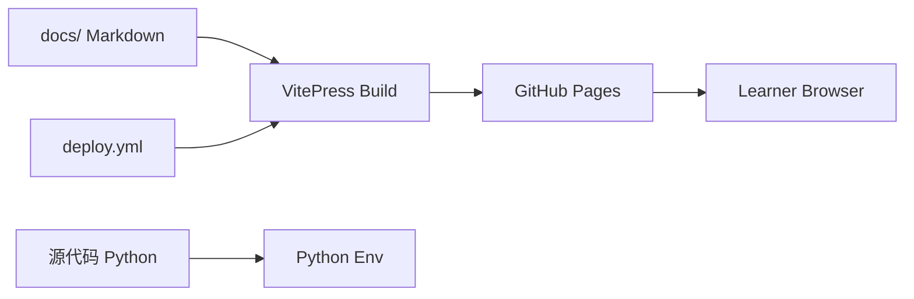

# NanmiCoder/CrawlerTutorial

> Tutoriel en chinois sur le crawling web, de l'initiation aux techniques avancées, avec code Python.

## Le problème
Apprendre à collecter des données web de façon structurée : outils, requêtes, stockage, navigateur automatisé, authentification.

## Ce que ça fait vraiment
Un site de documentation (VitePress, publié via GitHub Actions) accompagné d'un dossier `源代码` de scripts Python par chapitre. Le README liste 11 chapitres d'introduction et 11 d'approfondissement (requêtes, proxys, Playwright, cookies, captchas, nettoyage, analyse) ; la partie « avancé » est marquée « à venir ». Des vidéos sont annoncées.

## Comment c'est branché


## Essayer
```bash
# Aucune commande dans le README.
# Lecture en ligne : https://nanmicoder.github.io/CrawlerTutorial/
```

## Coût et pièges
Gratuit. Contenu en chinois. Aucune licence déclarée : réutilisation du code et des textes non autorisée par défaut.

## Ce que ce n'est pas
Ce n'est pas une bibliothèque installable. Le README interdit l'usage commercial et la collecte à grande échelle de plateformes tierces ; la partie avancée n'existe pas encore. Le code n'a pas été relu ici.

## Alternatives
- MediaCrawler : autre dépôt de l'auteur, cité dans le README.

## Pour toi
À surveiller : utile si tu lis le chinois et veux une progression pédagogique ; l'absence de licence et le périmètre non commercial limitent la réutilisation.
