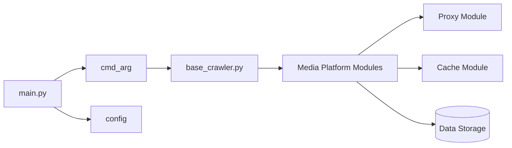

# NanmiCoder/MediaCrawler

> Crawler Playwright des plateformes sociales chinoises (Xiaohongshu, Douyin, Bilibili, Weibo, Zhihu…) : posts et commentaires.

## Le problème
Collecter des publications et commentaires publics de plateformes chinoises oblige d'habitude à rétro-ingénierer leurs signatures JavaScript.

## Ce que ça fait vraiment
Le crawler se connecte à ton Chrome ouvert en mode CDP (ou lance Playwright), réutilise la session connectée et récupère les paramètres de signature par des expressions JS, sans rétro-ingénierie.
`main.py` lit les arguments (`cmd_arg`) et la configuration (`config/base_config.py`), puis délègue à un module par plateforme (`media_platform`) sur une base commune (`base_crawler.py`), avec cache local ou Redis et pool de proxies.
Recherche par mots-clés, posts par ID, commentaires de second niveau, pages de créateurs, médias (couvertures, vidéos). Stockage CSV, JSON, Excel, SQLite ou MySQL ; WebUI optionnelle.

## Comment c'est branché


## Essayer
```bash
cd MediaCrawler
uv sync
uv run playwright install
uv run main.py --platform xhs --lt qrcode --type search
uv run main.py --help
```

## Coût et pièges
Gratuit, mais un compte sur chaque plateforme (connexion par QR code), Chrome 144+ ou Playwright, Node.js 16+. Licence non identifiée par GitHub ; le README interdit tout usage commercial.

## Ce que ce n'est pas
Le README le réserve à l'apprentissage et décline toute responsabilité : pas un outil de collecte à grande échelle. Reprise sur interruption et multi-comptes sont réservés à MediaCrawlerPro, payant.

## Alternatives
- MediaCrawlerPro — version payante du même auteur : reprise, multi-comptes, sans Playwright.

## Pour toi
À ignorer : risque juridique et plateformes hors de ton périmètre.
