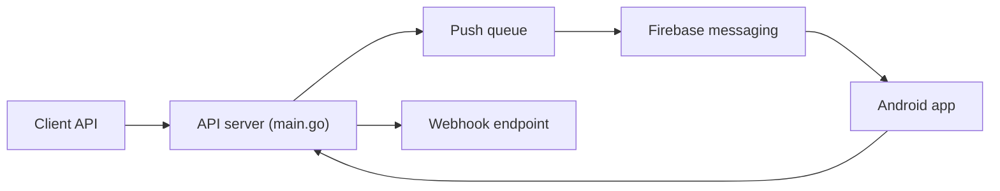

# NdoleStudio/httpsms

> Passerelle SMS : une API HTTP qui fait envoyer et recevoir des SMS par un téléphone Android.

## Le problème
Acheter des numéros virtuels n'est pas possible dans tous les pays ; l'auteur voulait un moyen simple d'envoyer et recevoir des SMS par API.

## Ce que ça fait vraiment
L'API Go (Fiber, CockroachDB) enregistre le message et met en file une notification push ; l'application Android reçoit la notification, récupère le message, l'envoie par l'API SMS d'Android et remonte résultat et accusé de livraison. Webhooks pour les SMS reçus, chiffrement AES-256 de bout en bout, limitation de débit, expiration des messages. Interface Nuxt/Vuetify.

## Comment c'est branché


## Essayer
```bash
git clone https://github.com/NdoleStudio/httpsms.git
cp web/.env.docker web/.env
cp api/.env.docker api/.env
docker compose up --build
```

## Coût et pièges
Auto-hébergement : compte Firebase (push et authentification), SMTP, Cloudflare Turnstile, création manuelle d'un utilisateur système en base, compilation de l'application Android. Tarifs du service hébergé non documentés (le graphe mentionne un composant de facturation). Licence AGPL-3.0.

## Ce que ce n'est pas
Pas un fournisseur de numéros virtuels : les SMS partent de ton téléphone et de ton forfait mobile.

## Alternatives
Aucune alternative nommée dans le README.

## Pour toi
À surveiller : utile pour des alertes SMS de pipelines sans passer par un fournisseur, mais l'installation est lourde et la dépendance à Firebase forte.

