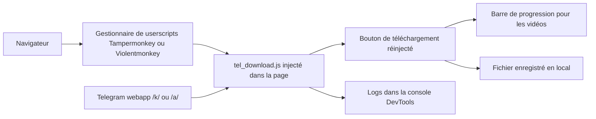

# Neet-Nestor/Telegram-Media-Downloader

> **A browser userscript that puts the media download button back into the Telegram web app.**

## The problem

Some Telegram channels and chats disable content saving: the download button disappears from
the web interface, and the image, GIF or video on screen can no longer be retrieved through
the app itself. Without a third-party tool, only screenshots remain, which lose quality and
do not work at all for audio or video.

## What it actually does

It is a userscript, loaded by a manager such as Tampermonkey or Violentmonkey, that runs
inside the Telegram web app page. It re-injects a download button for images, GIFs, audios
and videos, including in chats, stories and private channels where downloading is restricted.
For videos it shows a progress bar in the bottom-right corner; for images and audios there is
no progress bar. The README notes that some features exist only on one web app version: voice
message download is available only on the K version. On channels that already allow saving,
the script has no effect and the README points back to the official button.

## How it is wired



There is no server and no backend: everything happens in the tab. The userscript manager
loads `src/tel_download.js` on Telegram web app pages, the script hooks its button into the
existing UI, and the file goes straight to the browser's disk. The README targets two web app
versions, `web.telegram.org/k/` (recommended) and `web.telegram.org/a/`, and suggests
switching to the K version when a feature misbehaves. The DevTools console acts as the log.

## Trying it

```bash
# No install commands: installation happens in the browser.
# 1. install a userscript manager (Tampermonkey, Violentmonkey, Greasemonkey, Userscripts)
# 2. install from https://greasyfork.org/scripts/446342-telegram-media-downloader
# or manually: open the Tampermonkey Dashboard, drag & drop src/tel_download.js into it
# and click "install"

# The only commands in the README are for contributors:
git clone https://github.com/YOUR-USERNAME/Telegram-Media-Downloader.git
cd Telegram-Media-Downloader
git checkout -b feature-or-bugfix-name
git commit -m "Add feature/fix issue: Brief description"
git push origin feature-or-bugfix-name
```

## Cost and traps

Free, no API key, no extra account beyond the Telegram one. You do need a userscript manager
in the browser, and the README warns that Chrome-based browsers with Tampermonkey require
Developer Mode to be enabled. The real cost lies elsewhere: the tool works around a
restriction the channel owners chose, which is a usage question before a technical one. The
script depends on the Telegram web app UI, which is not a stable API: any redesign can break
it, and the README already admits feature gaps between the /k/ and /a/ versions. The author
takes donations via Venmo and Ko-fi; nothing suggests funding beyond that.

## What it is not

It is not a Telegram client, nor a bulk archiver for whole channels: it adds a button, one
media at a time, in an open page. It is not a command-line tool or an API bot either — it
only runs in the browser on the web app, and the README states plainly that it has no effect
on channels that already allow saving. It decrypts nothing and grants access to no content
the account cannot already see. Support is also uneven: audio is handled on only one of the
two web app versions.

## Alternatives

The README names no competing project, and no catalogue neighbours were supplied for this
repository: no comparable alternative in the catalogue. The only third-party tools mentioned
are the userscript managers themselves (Tampermonkey, Violentmonkey, Greasemonkey,
Userscripts), which are prerequisites rather than substitutes.

## For you

Marginal interest for a data / AI / MLOps profile: nothing here automates or plugs into a
pipeline, it is manual convenience inside a browser. Worth keeping as a readable example of a
userscript hooking into a SPA — and as a reminder that building a Telegram corpus belongs to
the official API, not to this script.
