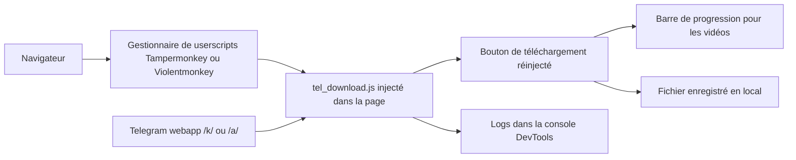

# Neet-Nestor/Telegram-Media-Downloader

> **Userscript navigateur qui rétablit le bouton de téléchargement des médias dans le Telegram web.**

## Le problème

Certains canaux et discussions Telegram désactivent la sauvegarde du contenu : le bouton de
téléchargement disparaît de l'interface web, et l'image, le GIF ou la vidéo qu'on a sous les
yeux n'est plus récupérable par les moyens fournis par l'application. Sans outil tiers, il ne
reste que la capture d'écran, qui perd la qualité et ne marche pas pour l'audio ni la vidéo.

## Ce que ça fait vraiment

C'est un script utilisateur (userscript) chargé par un gestionnaire type Tampermonkey ou
Violentmonkey, qui s'exécute dans la page du webapp Telegram. Il réinjecte un bouton de
téléchargement pour les images, les GIFs, les audios et les vidéos, y compris dans les chats,
les stories et les canaux privés où le téléchargement est restreint. Pour les vidéos, il
affiche une barre de progression en bas à droite de l'écran ; pour les images et les audios,
il n'y a pas de barre de progression. Le README précise que certaines fonctions ne sont
disponibles que sur une version précise du webapp : le téléchargement des messages vocaux
n'existe que sur la version K. Sur les canaux qui autorisent déjà la sauvegarde, le script
n'a aucun effet et le README renvoie au bouton officiel.

## Comment c'est branché



Il n'y a pas de serveur ni de backend : tout se passe dans l'onglet. Le gestionnaire de
userscripts charge `src/tel_download.js` sur les pages du webapp Telegram, le script accroche
son bouton dans l'interface existante, et le fichier descend directement vers le disque du
navigateur. Le README indique deux versions cibles du webapp, `web.telegram.org/k/`
(recommandée) et `web.telegram.org/a/`, et conseille de basculer sur la version K si une
fonction ne marche pas. La console DevTools sert de journal.

## Essayer

```bash
# Aucune commande d'installation : l'installation passe par le navigateur.
# 1. installer un gestionnaire de userscripts (Tampermonkey, Violentmonkey, Greasemonkey,
#    Userscripts selon le navigateur)
# 2. installer le script depuis https://greasyfork.org/scripts/446342-telegram-media-downloader
# ou, en manuel : ouvrir le Tampermonkey Dashboard, glisser-déposer src/tel_download.js
# dedans et cliquer sur "install"

# Les seules commandes du README concernent la contribution :
git clone https://github.com/YOUR-USERNAME/Telegram-Media-Downloader.git
cd Telegram-Media-Downloader
git checkout -b feature-or-bugfix-name
git commit -m "Add feature/fix issue: Brief description"
git push origin feature-or-bugfix-name
```

## Coût et pièges

Gratuit, pas de clé d'API, pas de compte à créer en plus du compte Telegram. Il faut en
revanche un gestionnaire de userscripts installé dans le navigateur, et le README signale
que sous Chrome avec Tampermonkey il faut activer le Developer Mode. Le vrai coût est
ailleurs : l'outil contourne une restriction voulue par les auteurs des canaux, ce qui pose
une question d'usage avant une question technique. Le script dépend de l'interface du webapp
Telegram, qui n'est pas une API stable : toute refonte côté Telegram peut le casser, et le
README admet déjà des écarts de fonctionnalités entre les versions /k/ et /a/. L'auteur
accepte des dons via Venmo et Ko-fi ; rien n'indique de financement au-delà.

## Ce que ce n'est pas

Ce n'est pas un client Telegram, ni un téléchargeur en masse d'archives de canaux : il ajoute
un bouton, média par média, dans une page ouverte. Ce n'est pas non plus un outil en ligne de
commande ni un bot utilisant l'API Telegram — il ne fonctionne que dans le navigateur, sur le
webapp, et le README dit explicitement qu'il n'a aucun effet sur les canaux qui autorisent
déjà la sauvegarde. Il ne déchiffre rien et ne donne accès à aucun contenu que le compte ne
voit pas déjà. Enfin, le support n'est pas uniforme : l'audio n'est pris en charge que sur
une des deux versions du webapp.

## Alternatives

Le README ne nomme aucun projet concurrent, et aucun voisin de catalogue n'a été fourni pour
ce dépôt : aucune alternative comparable dans le catalogue. Les seuls outils tiers cités sont
les gestionnaires de userscripts eux-mêmes (Tampermonkey, Violentmonkey, Greasemonkey,
Userscripts), qui sont des prérequis et non des substituts.

## Pour toi

Intérêt marginal pour un profil data / IA / MLOps : rien ici ne s'automatise ni ne s'intègre
à un pipeline, c'est un confort d'usage manuel dans le navigateur. À garder en tête comme
exemple lisible de userscript qui s'accroche à une SPA — et comme rappel que pour constituer
un corpus Telegram, c'est vers l'API officielle qu'il faut se tourner, pas vers ce script.
