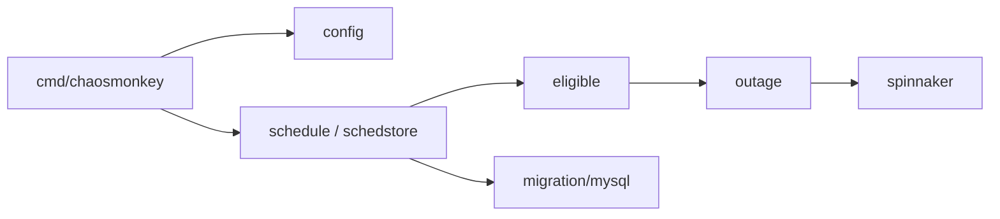

# Netflix/chaosmonkey

> Outil de Netflix qui éteint au hasard des instances en production, pour équipes gérées avec Spinnaker.

## Le problème
On découvre la fragilité d'un service le jour de la panne. Sans pannes provoquées et régulières, personne ne construit de services qui tiennent.

## Ce que ça fait vraiment
Chaos Monkey termine au hasard des machines virtuelles ou conteneurs de production. Il passe obligatoirement par Spinnaker : sans applications gérées par Spinnaker, il ne peut rien terminer. Testé avec AWS, GCE et Kubernetes. Le code décrit un planificateur (`schedule`, `schedstore`), des règles d'éligibilité (`eligible`), un module de terminaison (`outage`) et un stockage MySQL (`migration`).

## Comment c'est branché


## Essayer
```bash
go get github.com/netflix/chaosmonkey/cmd/chaosmonkey
```
Le déploiement et la configuration sont renvoyés à la documentation externe : non documenté dans le README.

## Coût et pièges
Il faut Spinnaker déjà en place et une base MySQL pour l'ordonnancement. Le dernier push date de janvier 2025 : plus d'un an sans mise à jour.

## Ce que ce n'est pas
Ce n'est pas un outil autonome : sans Spinnaker, il ne fait rien. Ce n'est pas un banc d'essai pour un poste local ni un outil d'injection de fautes fines (latence, réseau) : il ne fait qu'éteindre des instances.

## Alternatives
Aucune alternative nommée dans le README (seuls les Principles of Chaos Engineering sont cités).

## Pour toi
À surveiller : utile pour comprendre la pratique du chaos en production, mais inutilisable sans Spinnaker et sans mise à jour récente, donc peu pertinent pour un profil data/MLOps qui n'a pas cette plateforme.

