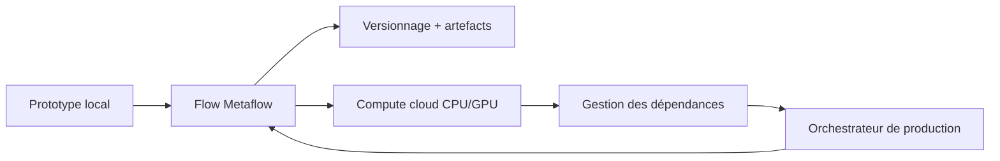

# Netflix/metaflow

> Framework Python qui mène un projet ML du notebook au workflow de production.

## Le problème
Le passage du prototype à la production casse le code : suivi d'expériences bricolé, dépendances
non reproductibles, passage à l'échelle réécrit, et déploiement confié à un autre outil.

## Ce que ça fait vraiment
Une API Python unique couvre trois besoins : prototypage local avec notebooks, suivi d'expériences,
versionnage et visualisation intégrés ; passage à l'échelle horizontal et vertical dans votre cloud,
CPU comme GPU, avec accès rapide aux données pour des charges massivement parallèles ou gang-schedulées ;
gestion des dépendances et déploiement en un clic vers des orchestrateurs de production hautement
disponibles, avec orchestration réactive. Créé chez Netflix, aujourd'hui soutenu par Outerbounds.

## Comment c'est branché


## Essayer
```bash
pip install metaflow
conda install -c conda-forge metaflow
```

## Coût et pièges
Gratuit en local. Les vrais bénéfices (compute externe, orchestrateur de production) supposent de
déployer l'infrastructure dans votre cloud, en suivant le guide dédié : la facture est la vôtre.
Le bac à sable Metaflow permet d'essayer sans rien installer.

## Ce que ce n'est pas
Pas une plateforme managée : le dépôt est la bibliothèque, l'infrastructure reste à monter (ou à acheter
chez Outerbounds). Pas un outil de modélisation : il orchestre, il n'entraîne pas à votre place.
Aucune licence indiquée dans le README.

## Alternatives
Aucun dépôt alternatif n'est nommé dans le README.

## Pour toi
Le choix raisonnable pour structurer un projet ML destiné à durer, sans réécrire en passant en prod.
