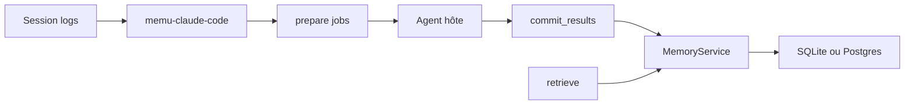

# NevaMind-AI/memU

> Mémoire partagée en wiki Markdown pour agents de code, alimentée par leurs historiques de session.

## Le problème
Chaque agent (Claude Code, Codex, Cursor…) oublie tout entre sessions et ne partage rien avec les autres.

## Ce que ça fait vraiment
Adaptateurs par hôte (`memu-claude-code`, `memu-codex`…) qui lisent les logs de session et patchent le fichier d'instructions.
Une tâche planifiée découpe les sessions en jobs ; l'agent lui-même en tire mémoires et skills Markdown, puis `commit`.
`MemoryService` n'appelle aucun LLM : il stocke, embed et restitue.
Backends : cloud memU, SQLite, Postgres/pgvector ; embeddings OpenAI, Jina, Voyage…

## Comment c'est branché


## Essayer
```bash
pip install memu-cli
memu-codex retrieve "What should I remember about this project?"
```

## Coût et pièges
Clé memu.so pour le cloud, ou clé d'embedding en local. L'installation passe par un SKILL.md distant exécuté par ton agent.

## Ce que ce n'est pas
Pas un serveur de mémoire autonome avec LLM : la synthèse repose sur ton agent. Support variable selon hôte et OS.

## Alternatives
Aucune alternative nommée dans le README.

## Pour toi
À surveiller : l'extraction automatique de skills depuis tes sessions Claude Code est pertinente, mais faire exécuter un script distant par ton agent mérite prudence.
