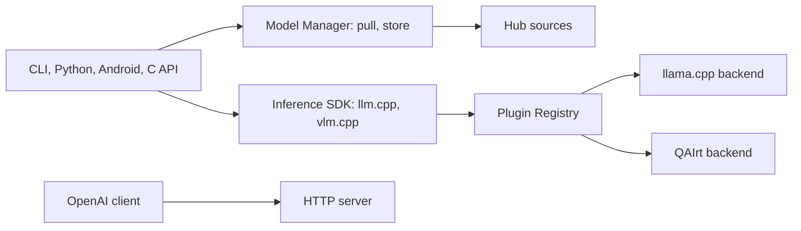

# NexaAI/nexa-sdk

> Runtime d'inférence sur appareil (LLM et VLM) pour puces Qualcomm : NPU Hexagon, GPU Adreno ou CPU.

## Le problème
Faire tourner localement des modèles de langage et de vision sur des appareils Snapdragon en exploitant leur NPU, avec des formats de modèles très différents.

## Ce que ça fait vraiment
Le README présente « GenieX », version communautaire de Qualcomm GENIE (le dépôt s'appelle nexa-sdk : écart de nom à noter). Un SDK C unique est exposé par un CLI (`geniex infer`), Python, Kotlin/Java, Docker et un serveur compatible OpenAI. Deux runtimes : llama.cpp (GGUF depuis Hugging Face, NPU/GPU/CPU) et Qualcomm AI Engine Direct (bundles compilés du AI Hub, NPU seul).

## Comment c'est branché


## Essayer
```bash
curl -fsSL https://qaihub-public-assets.s3.us-west-2.amazonaws.com/qai-hub-geniex/install.sh | sh
geniex infer google/gemma-4-E4B-it-qat-q4_0-gguf
pip install geniex
geniex pull ai-hub-models/Qwen3-4B-Instruct-2507
geniex serve
```
Le serveur écoute sur http://127.0.0.1:18181/v1.

## Coût et pièges
Gratuit. Cible Windows ARM64, Linux ARM64 et Android : il faut un appareil Qualcomm. Le README recommande la précision `Q4_0` pour la meilleure prise en charge du NPU Hexagon. L'installation se fait par `curl | sh`.

## Ce que ce n'est pas
Ce n'est pas un runtime pour GPU NVIDIA ni pour Mac : le README ne cible que des appareils Qualcomm. Le README ne donne aucun chiffre de performance.

## Alternatives
llama.cpp est utilisé comme backend, non comme concurrent.

## Pour toi
Surveiller : intéressant si tu déploies de l'IA embarquée sur Snapdragon, mais réservé à ce matériel, version 0.3 côté Android et nommage ambigu.

